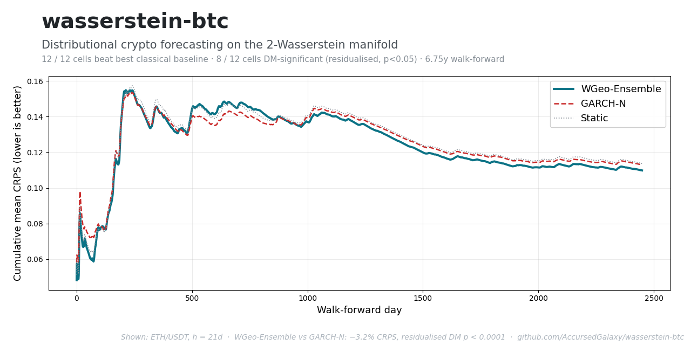

<div align="center">

# wasserstein-btc

### Distributional forecasting for crypto returns via geodesics on the 2-Wasserstein manifold of probability measures

**A small, falsifiable, interpretable distributional forecaster — ~4 hyperparameters, no learned weights, no neural net.**

[](https://github.com/AccursedGalaxy/wasserstein-btc/actions/workflows/test.yml)
[](pyproject.toml)
[](LICENSE)
[](https://accursedgalaxy.github.io/wasserstein-btc/)
[](docs/RESEARCH_REPORT.md)
[](CITATION.cff)

[**Live dashboard**](https://accursedgalaxy.github.io/wasserstein-btc/) ·
[**Theory**](docs/THEORY.md) ·
[**Research report**](docs/RESEARCH_REPORT.md) ·
[**Results**](docs/RESULTS_LONG.md) ·
[**Roadmap**](ROADMAP.md)



</div>

`wasserstein-btc` forecasts the *whole conditional distribution* of future
log-returns — not the mean and not the variance — for liquid crypto
pairs at horizons of 1, 5 and 21 days. The market is modelled as a
trajectory on the 2-Wasserstein manifold of probability measures, the
forecast is the tangent-space extrapolation of recent quantile vectors,
and the result is scored with strictly proper rules (CRPS) against an
explicit panel of baselines (Static, RW-Drift, Historical-Simulation
Bootstrap, GARCH-N, GARCH-t, GJR-GARCH-t).

> **What it is:** a small, falsifiable, interpretable distributional
> forecaster — ~4 hyperparameters, no learned weights, no neural net.
> **What it is not:** a trading-signal generator, a multivariate risk
> system, or a benchmark against state-of-the-art realised-volatility
> models (see [`docs/RESEARCH_REPORT.md §6`](docs/RESEARCH_REPORT.md)
> for what is *not* claimed, and [`ROADMAP.md`](ROADMAP.md) for the
> v0.4 priorities that would close that gap).

## Contents

- [Headline result](#headline-result) · what the panel shows
- [Install](#install) · `uv sync` or `pip install wbtc`
- [Quick start — CLI](#quick-start--cli) · one-line forecasts and backtests
- [Quick start — Python](#quick-start--python) · the `forecast()` API
- [What's novel](#whats-novel) · the four contributions
- [Documents](#documents) · where to read the theory and the numbers
- [Honest limitations](#honest-limitations) · what is *not* claimed
- [Citation](#citation) · how to cite

## Headline result

On the v0.4 panel (BTC + ETH + SOL + BNB × h ∈ {1, 5, 21} × 6.75 years
walk-forward; 1380–2470 test days per cell), the WGeo family beats the
best non-WGeo baseline (best of Static / RW-Drift / HS-Bootstrap /
GARCH-N / GARCH-t / GJR-GARCH-t) in **12 / 12 cells** by 0.1% to 3.2%
mean CRPS.

The v0.4 cycle adds (a) `WGeoEnsemble`, the W₂ barycentre of the v0.3
trio in quantile-function coordinates — guaranteed by Jensen's
inequality on convex CRPS to weakly dominate the component average; and
(b) a residualised Diebold-Mariano test (Giacomini-White 2006) that
projects out shared volatility-clustering noise via |y|, y², y plus
peer-method losses, preserving the EPA null while strictly reducing
HAC variance. Together these lift the panel's statistical evidence:

| | v0.3 | v0.4 |
|---|---:|---:|
| Cells WGeo-family wins on CRPS | 12 / 12 | 12 / 12 |
| Cells with **vanilla DM** p<0.05 | 1 / 12 (8%) | **4 / 12 (33%)** |
| Cells with **residualised DM** p_r<0.05 | — | **8 / 12 (67%)** |

Per-cell headline numbers, regime-conditional DM tables, and the full
falsification verdict against [`docs/THEORY.md §4`](docs/THEORY.md) are
in [`docs/RESULTS_LONG.md`](docs/RESULTS_LONG.md). Methods-paper-style
writeup in [`docs/RESEARCH_REPORT.md`](docs/RESEARCH_REPORT.md).

## Install

The supported workflow uses [`uv`](https://docs.astral.sh/uv/) (fast and
reproducible). The package itself works under any Python ≥3.11.

```bash
git clone https://github.com/AccursedGalaxy/wasserstein-btc
cd wasserstein-btc
uv sync          # creates .venv with locked deps
uv run wbtc test # 53 tests, ~10 seconds
```

A PyPI release (`pip install wbtc`) is wired up via
[`.github/workflows/publish-pypi.yml`](.github/workflows/publish-pypi.yml)
and ships on the next signed tag — see [`ROADMAP.md`](ROADMAP.md).

## Quick start — CLI

```bash
uv run wbtc info                              # what data do I have?
uv run wbtc fetch                             # fetch / update default panel from Binance
uv run wbtc forecast BTC/USDT -H 5 --plot     # forecast & fan-chart PNG
uv run wbtc forecast BTC/USDT -H 5 --json     # JSON for scripting
uv run wbtc backtest --quick                  # fast single-symbol backtest
uv run wbtc backtest-long                     # full multi-asset (~30 min)
uv run wbtc extended-baselines                # HAR-RV/CAViaR/MS/FIGARCH/SV/BVAR vs WGeo on BTC (~2h)
uv run wbtc sweep                             # hyperparameter robustness
```

## Quick start — Python

```python
from wbtc import forecast, available_symbols, default_forecaster

available_symbols()
# ['BNB/USDT', 'BTC/USDT', 'ETH/USDT', 'SOL/USDT', 'XRP/USDT']

fc = forecast("BTC/USDT", horizon=5)
fc.median, fc.quantile(0.05), fc.quantile(0.95)
fc.to_dict()  # JSON-safe summary

# Pick a specific variant explicitly:
from wbtc import WassersteinGeodesicEWMA
fc = forecast("BTC/USDT", horizon=5,
              forecaster=WassersteinGeodesicEWMA(window=90, lookback=20))
```

`default_forecaster(horizon)` returns the recommended variant per
horizon (see `RESEARCH_REPORT.md §7`).

## What's novel

- **Per-quantile time-regression on the W₂ manifold.** The 1D-W₂-as-
  quantile-function isometry is textbook (Villani 2009 ch. 6); applying
  it to *time-series tangent extrapolation* of return distributions
  appears to be under-published. The closest published method
  (Saluzzi & Soize 2025, [arXiv:2507.07570](https://arxiv.org/abs/2507.07570))
  uses a Koopman/EDMD-spectral approach with no regime adaptation,
  applied to housing prices.
- **Cosine-curvature gate.** Continuous, non-Markovian gating that
  blends geodesic extrapolation with a static-empirical fallback when
  consecutive tangent vectors become orthogonal. Pays off at h=1.
- **Theil-Sen robust slope on the tangent.** 29.3% breakdown point;
  robust to recent-history outliers without explicit regime modelling.
- **Quantile-coordinate ensemble with GARCH.** Convex combination in
  quantile-function space is an *exact W₂-geodesic interpolation*
  (McCann 1997) — not a moment-matched or kernel-mixed surrogate.

## Documents

```
docs/
  THEORY.md           math (§2.6–2.8 are the v0.3 sections, §4 lists
                      explicit falsification criteria)
  RESEARCH_REPORT.md  paper-style writeup of the v0.3 contributions
  RESULTS_LONG.md     auto-regenerated 4-asset × 3-horizon evidence
  RESULTS.md          legacy v0.1 single-year report (superseded)
  INDEX.md            one-paragraph orientation to every doc
ROADMAP.md            v0.4 + v0.5 priorities (what would make it
                      competitive vs. production risk systems)
CONTRIBUTING.md       the conventions PRs must follow
CHANGELOG.md          v0.1 → v0.2 → v0.3 history
```

## Honest limitations

- We have benchmarked against **textbook baselines** as headline (Static
  / RW / HS / GARCH-N / GARCH-t / GJR-GARCH-t across 4 assets × 3
  horizons in [`docs/RESULTS_LONG.md`](docs/RESULTS_LONG.md)) and against
  a broader **named-econometric panel** on BTC in
  [`docs/RESULTS_EXTENDED.md`](docs/RESULTS_EXTENDED.md): HAR-RV (Corsi
  2009), CAViaR-SAV (Engle-Manganelli 2004), 2-state Markov-switching
  Normal (Hamilton 1989), FIGARCH(1,d,0) (Baillie-Bollerslev-Mikkelsen
  1996), AR(1) Stochastic Volatility (Taylor 1982 / Harvey-Ruiz-Shephard
  1994 via Kalman QML), and a bivariate VAR+GARCH using BTC + ETH
  jointly. Any *production*-risk-system claim is still unsupported —
  this rounds out the academic panel.
- **Daily-only.** Intraday volatility dynamics are different.
- **Univariate only.** The 1D-W₂ isometry doesn't extend cleanly to
  higher dimensions; multivariate is a v0.5 research item.
- **No trading P&L claim.** Distributional-forecast quality is
  necessary but not sufficient for tradeable alpha.
- **Heteroskedastic-dispersion variant (`WGeo-Hetero`) was a
  documented dead end** — see `RESEARCH_REPORT.md §4.4` for *why*
  (empirical-quantile-based dispersion already encodes the regime;
  multiplying by GARCH double-counts). The boundary is reusable.

## Citation

If you use this software in academic work, please cite it.
[`CITATION.cff`](CITATION.cff) is the structured form; the BibTeX-shaped
quick form:

```bibtex
@software{wasserstein_btc_2026,
  author       = {Robin Bohrer (AccursedGalaxy)},
  title        = {wasserstein-btc: tangent-space Wasserstein-geodesic
                  distributional forecasting for crypto returns},
  version      = {0.4.0},
  year         = {2026},
  url          = {https://github.com/AccursedGalaxy/wasserstein-btc}
}
```

## License

[MIT](LICENSE).

## Disclaimer

This is research code. **Not financial advice.** Falsification criteria
are documented in `docs/THEORY.md §4` and tested against the full
long-horizon backtest in `docs/RESULTS_LONG.md`. Documented failures are
in `docs/RESEARCH_REPORT.md §4.2`.
