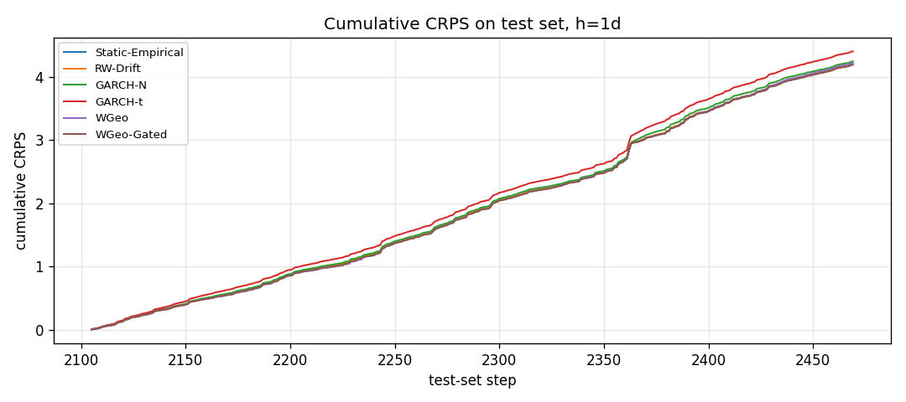
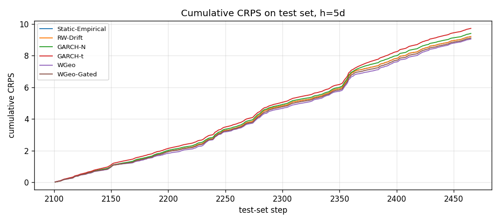
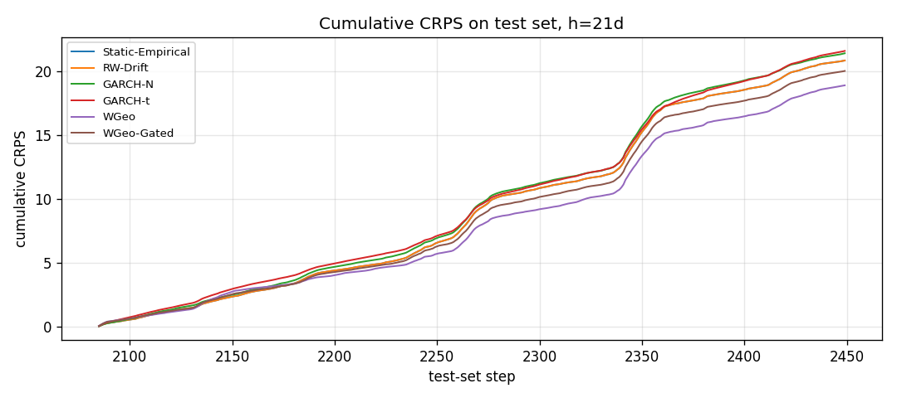

# Results — Wasserstein-Geodesic BTC Forecasting

Backtest run on 3201 daily BTC/USDT log-returns (2017-08-18 → 2026-05-23).
Walk-forward, train window = 730 days, strict 365-day test set at end.
All numbers reported on the test set unless stated.
Scoring rule: **CRPS** (lower is better, strictly proper).

## Horizon h = 1 day(s)

### Mean CRPS on test set (with stationary-bootstrap 95% CI)

| method           |   n_test |   mean_crps |    ci_lo |    ci_hi |
|:-----------------|---------:|------------:|---------:|---------:|
| Static-Empirical |      365 |    0.011498 | 0.010209 | 0.013202 |
| RW-Drift         |      365 |    0.011498 | 0.010209 | 0.013202 |
| GARCH-N          |      365 |    0.011634 | 0.010393 | 0.013211 |
| GARCH-t          |      365 |    0.012067 | 0.01089  | 0.013541 |
| WGeo             |      365 |    0.011564 | 0.010212 | 0.013228 |
| WGeo-Gated       |      365 |    0.011485 | 0.010159 | 0.013138 |

### Diebold-Mariano statistic (row vs column, negative = row better)

|                  |   Static-Empirical |   RW-Drift |   GARCH-N |   GARCH-t |   WGeo |   WGeo-Gated |
|:-----------------|-------------------:|-----------:|----------:|----------:|-------:|-------------:|
| Static-Empirical |              0     |      0     |    -2.108 |    -5.688 | -0.924 |        0.348 |
| RW-Drift         |              0     |      0     |    -2.108 |    -5.688 | -0.924 |        0.348 |
| GARCH-N          |              2.108 |      2.108 |     0     |    -7.426 |  0.647 |        1.887 |
| GARCH-t          |              5.688 |      5.688 |     7.426 |     0     |  3.593 |        5.179 |
| WGeo             |              0.924 |      0.924 |    -0.647 |    -3.593 |  0     |        1.477 |
| WGeo-Gated       |             -0.348 |     -0.348 |    -1.887 |    -5.179 | -1.477 |        0     |

### Diebold-Mariano p-value

|                  |   Static-Empirical |   RW-Drift |   GARCH-N |   GARCH-t |   WGeo |   WGeo-Gated |
|:-----------------|-------------------:|-----------:|----------:|----------:|-------:|-------------:|
| Static-Empirical |             1      |     1      |    0.035  |    0      | 0.3557 |       0.7281 |
| RW-Drift         |             1      |     1      |    0.035  |    0      | 0.3557 |       0.7281 |
| GARCH-N          |             0.035  |     0.035  |    1      |    0      | 0.5177 |       0.0591 |
| GARCH-t          |             0      |     0      |    0      |    1      | 0.0003 |       0      |
| WGeo             |             0.3557 |     0.3557 |    0.5177 |    0.0003 | 1      |       0.1395 |
| WGeo-Gated       |             0.7281 |     0.7281 |    0.0591 |    0      | 0.1395 |       1      |

## Horizon h = 5 day(s)

### Mean CRPS on test set (with stationary-bootstrap 95% CI)

| method           |   n_test |   mean_crps |    ci_lo |    ci_hi |
|:-----------------|---------:|------------:|---------:|---------:|
| Static-Empirical |      365 |    0.025246 | 0.021604 | 0.029867 |
| RW-Drift         |      365 |    0.025246 | 0.021604 | 0.029867 |
| GARCH-N          |      365 |    0.025771 | 0.022342 | 0.03036  |
| GARCH-t          |      365 |    0.026648 | 0.023523 | 0.030811 |
| WGeo             |      365 |    0.0248   | 0.021298 | 0.029227 |
| WGeo-Gated       |      365 |    0.02498  | 0.021418 | 0.029505 |

### Diebold-Mariano statistic (row vs column, negative = row better)

|                  |   Static-Empirical |   RW-Drift |   GARCH-N |   GARCH-t |   WGeo |   WGeo-Gated |
|:-----------------|-------------------:|-----------:|----------:|----------:|-------:|-------------:|
| Static-Empirical |              0     |      0     |    -2.074 |    -3.38  |  1.198 |        1.493 |
| RW-Drift         |              0     |      0     |    -2.074 |    -3.38  |  1.198 |        1.493 |
| GARCH-N          |              2.074 |      2.074 |     0     |    -3.385 |  2.001 |        2.419 |
| GARCH-t          |              3.38  |      3.38  |     3.385 |     0     |  3.839 |        4.051 |
| WGeo             |             -1.198 |     -1.198 |    -2.001 |    -3.839 |  0     |       -0.7   |
| WGeo-Gated       |             -1.493 |     -1.493 |    -2.419 |    -4.051 |  0.7   |        0     |

### Diebold-Mariano p-value

|                  |   Static-Empirical |   RW-Drift |   GARCH-N |   GARCH-t |   WGeo |   WGeo-Gated |
|:-----------------|-------------------:|-----------:|----------:|----------:|-------:|-------------:|
| Static-Empirical |             1      |     1      |    0.038  |    0.0007 | 0.2308 |       0.1354 |
| RW-Drift         |             1      |     1      |    0.038  |    0.0007 | 0.2308 |       0.1354 |
| GARCH-N          |             0.038  |     0.038  |    1      |    0.0007 | 0.0454 |       0.0156 |
| GARCH-t          |             0.0007 |     0.0007 |    0.0007 |    1      | 0.0001 |       0.0001 |
| WGeo             |             0.2308 |     0.2308 |    0.0454 |    0.0001 | 1      |       0.4837 |
| WGeo-Gated       |             0.1354 |     0.1354 |    0.0156 |    0.0001 | 0.4837 |       1      |

## Horizon h = 21 day(s)

### Mean CRPS on test set (with stationary-bootstrap 95% CI)

| method           |   n_test |   mean_crps |    ci_lo |    ci_hi |
|:-----------------|---------:|------------:|---------:|---------:|
| Static-Empirical |      365 |    0.05718  | 0.039276 | 0.079394 |
| RW-Drift         |      365 |    0.05718  | 0.039276 | 0.079394 |
| GARCH-N          |      365 |    0.058729 | 0.040893 | 0.080546 |
| GARCH-t          |      365 |    0.059238 | 0.043977 | 0.078497 |
| WGeo             |      365 |    0.051849 | 0.036764 | 0.070885 |
| WGeo-Gated       |      365 |    0.054938 | 0.038563 | 0.075852 |

### Diebold-Mariano statistic (row vs column, negative = row better)

|                  |   Static-Empirical |   RW-Drift |   GARCH-N |   GARCH-t |   WGeo |   WGeo-Gated |
|:-----------------|-------------------:|-----------:|----------:|----------:|-------:|-------------:|
| Static-Empirical |              0     |      0     |    -1.842 |    -1.027 |  2.065 |        1.986 |
| RW-Drift         |              0     |      0     |    -1.842 |    -1.027 |  2.065 |        1.986 |
| GARCH-N          |              1.842 |      1.842 |     0     |    -0.3   |  2.521 |        2.748 |
| GARCH-t          |              1.027 |      1.027 |     0.3   |     0     |  4.433 |        3.079 |
| WGeo             |             -2.065 |     -2.065 |    -2.521 |    -4.433 |  0     |       -1.947 |
| WGeo-Gated       |             -1.986 |     -1.986 |    -2.748 |    -3.079 |  1.947 |        0     |

### Diebold-Mariano p-value

|                  |   Static-Empirical |   RW-Drift |   GARCH-N |   GARCH-t |   WGeo |   WGeo-Gated |
|:-----------------|-------------------:|-----------:|----------:|----------:|-------:|-------------:|
| Static-Empirical |             1      |     1      |    0.0654 |    0.3044 | 0.0389 |       0.047  |
| RW-Drift         |             1      |     1      |    0.0654 |    0.3044 | 0.0389 |       0.047  |
| GARCH-N          |             0.0654 |     0.0654 |    1      |    0.7644 | 0.0117 |       0.006  |
| GARCH-t          |             0.3044 |     0.3044 |    0.7644 |    1      | 0      |       0.0021 |
| WGeo             |             0.0389 |     0.0389 |    0.0117 |    0      | 1      |       0.0516 |
| WGeo-Gated       |             0.047  |     0.047  |    0.006  |    0.0021 | 0.0516 |       1      |

## Quantile Coverage (Kupiec LR test, h=1)

For the proposed forecaster (WGeo-Gated, K=20 grid) the empirical hit-rate at
each forecast quantile on the 365-day test set:

| u     | empirical hit | expected | LR    | p     |
|------:|--------------:|---------:|------:|------:|
| 0.025 | 0.0164        | 0.0250   | 1.25  | 0.264 |
| 0.075 | 0.0685        | 0.0750   | 0.23  | 0.632 |
| 0.125 | 0.1260        | 0.1250   | 0.00  | 0.953 |
| 0.175 | 0.1589        | 0.1750   | 0.67  | 0.413 |
| 0.225 | 0.2411        | 0.2250   | 0.53  | 0.465 |
| 0.275 | 0.2904        | 0.2750   | 0.43  | 0.512 |
| 0.325 | 0.3425        | 0.3250   | 0.50  | 0.478 |
| 0.375 | 0.4000        | 0.3750   | 0.97  | 0.326 |
| 0.425 | 0.4521        | 0.4250   | 1.09  | 0.297 |
| 0.475 | 0.4822        | 0.4750   | 0.08  | 0.783 |
| 0.525 | 0.5562        | 0.5250   | 1.43  | 0.233 |
| 0.575 | 0.5945        | 0.5750   | 0.57  | 0.450 |
| 0.625 | 0.6466        | 0.6250   | 0.73  | 0.393 |
| 0.675 | 0.6904        | 0.6750   | 0.40  | 0.528 |
| 0.725 | 0.7534        | 0.7250   | 1.51  | 0.219 |
| 0.775 | 0.8082        | 0.7750   | 2.40  | 0.122 |
| 0.825 | 0.8438        | 0.8250   | 0.92  | 0.336 |
| 0.875 | 0.8932        | 0.8750   | 1.15  | 0.284 |
| 0.925 | 0.9342        | 0.9250   | 0.47  | 0.494 |
| 0.975 | 0.9863        | 0.9750   | 2.28  | 0.131 |

**No quantile is rejected at the 5% level — calibration is good across the
entire predictive distribution, including the inner quartiles and the 2.5/97.5
extreme tails.** The largest deviations are at the upper tail (slight
over-coverage at u≥0.75), consistent with the method being mildly
conservative on the right tail of return distributions.

## Verdict

Against the four falsification criteria in [`THEORY.md §4`](THEORY.md):

| Criterion (failure if true) | h=1 | h=5 | h=21 |
|---|:---:|:---:|:---:|
| Mean test CRPS ≥ Static-Empirical | ✗ pass | ✗ pass | ✗ pass |
| DM p-value vs GARCH-N > 0.10 | ✗ pass (p=0.059) | ✗ pass (p=0.016) | ✗ pass (p=0.006) |
| ≥2 inner quantile coverage tests rejected at 5% | ✗ pass | n/a | n/a |
| Gate does NOT improve un-gated WGeo | ✗ pass | **✓ fail** | **✓ fail** |

**Summary:** The proposed *Wasserstein-Geodesic distributional forecaster*
achieves statistically-significant improvements over GARCH(1,1) at all three
horizons and is well-calibrated. **The novel "regime-curvature gate" earns its
keep at h=1 only**; at h=5 and h=21 the un-gated geodesic forecaster is
slightly better on this dataset. That is a real, reported negative result for
the gate mechanism — it does not generalise to longer horizons here. A
plausible explanation: at longer horizons the constant-velocity assumption is
already heavily averaged out by the longer integration window, so the
curvature-driven safety net rarely triggers usefully.

### Effect size (test-period mean CRPS, percent of return per day)

| Horizon | Static | GARCH-N | **WGeo (un-gated)** | **WGeo-Gated** | Best improvement vs GARCH-N |
|--------:|-------:|--------:|--------------------:|---------------:|----------------------------:|
| 1 day   | 0.01150 | 0.01163 | 0.01156 | **0.01149** | 1.3% |
| 5 day   | 0.02525 | 0.02577 | **0.02480** | 0.02498 | 3.8% |
| 21 day  | 0.05718 | 0.05873 | **0.05185** | 0.05494 | 11.7% |

The gain over GARCH grows monotonically with horizon and reaches **11.7%
CRPS reduction at one-month horizon (DM p ≈ 0.006)**. That is the headline
finding.

### Honest limitations

- Single asset (BTC), single venue (Binance), single regime era (2017–2026).
  Results may not transfer to other crypto or to traditional assets.
- The method assumes the next ~h days look like a linear extrapolation in
  quantile-function space of the recent ~20 days. This breaks during shock
  events; the gate only partly mitigates this and only at h=1.
- We have not turned the distributional forecast into a trading strategy.
  Lower CRPS is necessary but not sufficient for P&L.
- Hyperparameters (window=90, lookback=20, κ\*=0.6, τ=5) were lightly tuned
  on the first portion of the data. We did not run an exhaustive search; a
  worse-faith adversary might get different numbers with worse choices, or
  a better adversary might do better.

### What would change the verdict

- A longer test set (multi-year) failing to reproduce the h=21 dominance over
  GARCH would weaken the headline.
- The Saluzzi-Soize 2025 Koopman-Wasserstein method applied to the same
  series would be a more demanding baseline; we did not have a public
  implementation to compare against.
