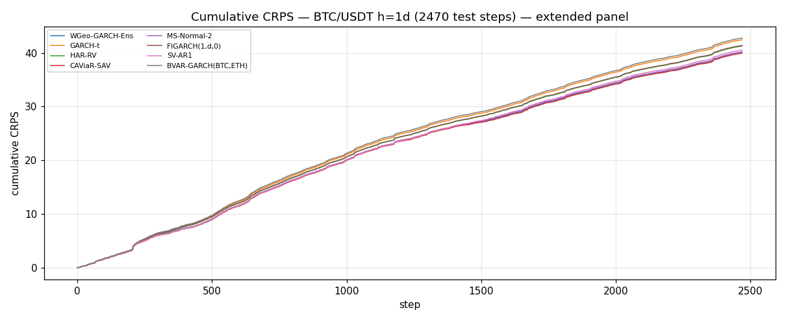
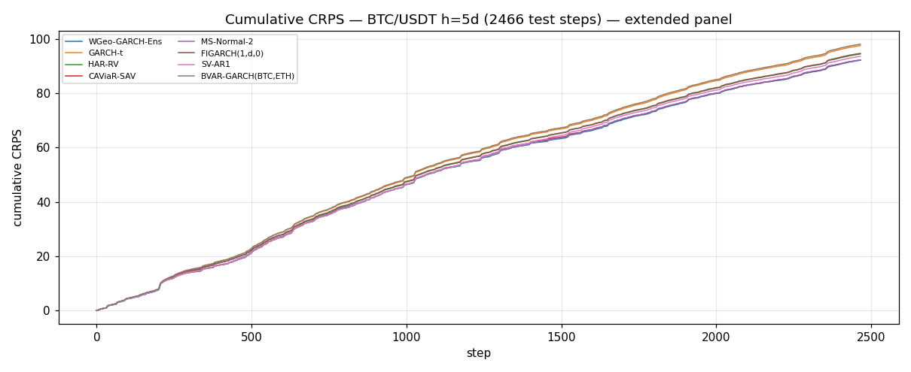
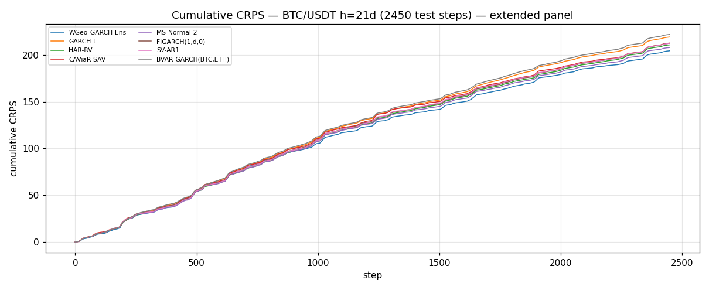

# Extended Baseline Comparison — BTC distributional forecasts

_Generated by `scripts/run_extended_baselines.py` on 2026-05-23_

**Why this report.** `docs/RESULTS_LONG.md` benchmarks the WGeo family
against light textbook baselines (Static / RW / HS-Bootstrap / GARCH-N /
GARCH-t / GJR-GARCH-t) on four assets and is the production result of
record. This file extends the comparison to *named econometric methods*
from adjacent families that practitioners ask about: HAR-RV (Corsi),
CAViaR (Engle-Manganelli), Markov-switching / MS-GARCH, FIGARCH
(long-memory), Stochastic Volatility (Kalman QML), and a bivariate
VAR+GARCH that uses ETH as an additional information source.

Restricted to BTC/USDT so the heavier per-step fits (FIGARCH MLE,
CAViaR per-quantile QR) complete in tractable time. Walk-forward,
burn-in 730 days, CRPS scoring on a 30-point grid — identical
protocol to `RESULTS_LONG.md`.

_3201 days from 2017-08-18 to 2026-05-23 (BTC ∩ ETH common dates)._

## Headline table — every method, every horizon

Lower `mean_crps` is better. `vs_anchor` is the percentage gap to
`WGeo-GARCH-Ens` (negative = the named baseline beats the anchor).
`dm_p_vs_anchor` is the Diebold-Mariano p-value comparing that
method's per-step loss series to the anchor's; small p favours the
anchor (because the anchor's mean is lower by construction at most
horizons here).

|   h | method              |   mean_crps | vs_anchor   |   dm_p_vs_anchor |
|----:|:--------------------|------------:|:------------|-----------------:|
|   1 | CAViaR-SAV          |    0.016169 | -0.5%       |           0.0352 |
|   1 | WGeo-GARCH-Ens      |    0.016253 | 0.0%        |           1      |
|   1 | MS-Normal-2         |    0.016264 | +0.1%       |           0.8412 |
|   1 | SV-AR1              |    0.016402 | +0.9%       |           0.0028 |
|   1 | HAR-RV              |    0.016712 | +2.8%       |           0      |
|   1 | FIGARCH(1,d,0)      |    0.016752 | +3.1%       |           0      |
|   1 | GARCH-t             |    0.017178 | +5.7%       |           0      |
|   1 | BVAR-GARCH(BTC,ETH) |    0.017303 | +6.5%       |           0      |
|   5 | WGeo-GARCH-Ens      |    0.037363 | 0.0%        |           1      |
|   5 | CAViaR-SAV          |    0.037393 | +0.1%       |           0.8787 |
|   5 | MS-Normal-2         |    0.037396 | +0.1%       |           0.8638 |
|   5 | SV-AR1              |    0.037944 | +1.6%       |           0.0067 |
|   5 | HAR-RV              |    0.038289 | +2.5%       |           0      |
|   5 | FIGARCH(1,d,0)      |    0.038379 | +2.7%       |           0      |
|   5 | GARCH-t             |    0.039544 | +5.8%       |           0      |
|   5 | BVAR-GARCH(BTC,ETH) |    0.039755 | +6.4%       |           0      |
|  21 | WGeo-GARCH-Ens      |    0.083394 | 0.0%        |           1      |
|  21 | MS-Normal-2         |    0.084823 | +1.7%       |           0.2894 |
|  21 | HAR-RV              |    0.085983 | +3.1%       |           0.0749 |
|  21 | SV-AR1              |    0.086648 | +3.9%       |           0.0261 |
|  21 | FIGARCH(1,d,0)      |    0.08667  | +3.9%       |           0.0175 |
|  21 | CAViaR-SAV          |    0.086795 | +4.1%       |           0.0126 |
|  21 | GARCH-t             |    0.089412 | +7.2%       |           0.0001 |
|  21 | BVAR-GARCH(BTC,ETH) |    0.090534 | +8.6%       |           0      |

### Horizon h = 1 day(s)  —  best: **CAViaR-SAV**

**Overall mean CRPS (bootstrap 95% CI):**

| method              |    n |   mean_crps |    ci_lo |    ci_hi |
|:--------------------|-----:|------------:|---------:|---------:|
| WGeo-GARCH-Ens      | 2470 |    0.016253 | 0.015388 | 0.017222 |
| GARCH-t             | 2470 |    0.017178 | 0.016407 | 0.018085 |
| HAR-RV              | 2470 |    0.016712 | 0.01593  | 0.017631 |
| CAViaR-SAV          | 2470 |    0.016169 | 0.01529  | 0.017144 |
| MS-Normal-2         | 2470 |    0.016264 | 0.015427 | 0.017221 |
| FIGARCH(1,d,0)      | 2470 |    0.016752 | 0.015966 | 0.01765  |
| SV-AR1              | 2470 |    0.016402 | 0.015551 | 0.01737  |
| BVAR-GARCH(BTC,ETH) | 2470 |    0.017303 | 0.01652  | 0.018207 |

**Per-year mean CRPS:**

|   year |   n |   WGeo-GARCH-Ens |   GARCH-t |   HAR-RV |   CAViaR-SAV |   MS-Normal-2 |   FIGARCH(1,d,0) |   SV-AR1 |   BVAR-GARCH(BTC,ETH) |
|-------:|----:|-----------------:|----------:|---------:|-------------:|--------------:|-----------------:|---------:|----------------------:|
|   2019 | 136 |          0.01618 |   0.01678 |  0.01675 |      0.01596 |       0.01618 |          0.01711 |  0.01604 |               0.01683 |
|   2020 | 366 |          0.01888 |   0.02034 |  0.01979 |      0.01866 |       0.01887 |          0.01973 |  0.01887 |               0.02061 |
|   2021 | 365 |          0.0233  |   0.02402 |  0.02342 |      0.02325 |       0.02336 |          0.02349 |  0.02325 |               0.02432 |
|   2022 | 365 |          0.01742 |   0.01854 |  0.01818 |      0.01743 |       0.01753 |          0.01816 |  0.01753 |               0.0187  |
|   2023 | 365 |          0.01212 |   0.01312 |  0.01304 |      0.01209 |       0.0123  |          0.01308 |  0.01296 |               0.01316 |
|   2024 | 366 |          0.015   |   0.01604 |  0.01503 |      0.0149  |       0.0149  |          0.01504 |  0.01511 |               0.01604 |
|   2025 | 365 |          0.01174 |   0.01236 |  0.01195 |      0.01174 |       0.01173 |          0.01198 |  0.01182 |               0.01242 |
|   2026 | 142 |          0.01391 |   0.01409 |  0.01374 |      0.01365 |       0.0135  |          0.01392 |  0.01384 |               0.01406 |

**Per-regime mean CRPS:**

| regime   |    n |   WGeo-GARCH-Ens |   GARCH-t |   HAR-RV |   CAViaR-SAV |   MS-Normal-2 |   FIGARCH(1,d,0) |   SV-AR1 |   BVAR-GARCH(BTC,ETH) |
|:---------|-----:|-----------------:|----------:|---------:|-------------:|--------------:|-----------------:|---------:|----------------------:|
| crash    |  320 |          0.02121 |   0.02242 |  0.02143 |      0.02098 |       0.0209  |          0.0217  |  0.02098 |               0.02277 |
| high-vol |   69 |          0.01947 |   0.02016 |  0.01919 |      0.01873 |       0.01902 |          0.01942 |  0.01863 |               0.02052 |
| neutral  | 1047 |          0.0154  |   0.01643 |  0.01609 |      0.01536 |       0.01549 |          0.01605 |  0.01556 |               0.01652 |
| low-vol  |  498 |          0.01193 |   0.01262 |  0.01254 |      0.01205 |       0.01211 |          0.01249 |  0.01268 |               0.01269 |
| rally    |  536 |          0.01856 |   0.01936 |  0.01866 |      0.01838 |       0.01851 |          0.01879 |  0.01849 |               0.01944 |

**Diebold-Mariano p-values vs WGeo-GARCH-Ens** (p < 0.05 favours WGeo-GARCH-Ens):

|                     |   p_vs_WGeo-GARCH-Ens |
|:--------------------|----------------------:|
| WGeo-GARCH-Ens      |                1      |
| GARCH-t             |                0      |
| HAR-RV              |                0      |
| CAViaR-SAV          |                0.0352 |
| MS-Normal-2         |                0.8412 |
| FIGARCH(1,d,0)      |                0      |
| SV-AR1              |                0.0028 |
| BVAR-GARCH(BTC,ETH) |                0      |

### Horizon h = 5 day(s)  —  best: **WGeo-GARCH-Ens**

**Overall mean CRPS (bootstrap 95% CI):**

| method              |    n |   mean_crps |    ci_lo |    ci_hi |
|:--------------------|-----:|------------:|---------:|---------:|
| WGeo-GARCH-Ens      | 2466 |    0.037363 | 0.034455 | 0.040212 |
| GARCH-t             | 2466 |    0.039544 | 0.036965 | 0.042101 |
| HAR-RV              | 2466 |    0.038289 | 0.035652 | 0.040899 |
| CAViaR-SAV          | 2466 |    0.037393 | 0.034484 | 0.040241 |
| MS-Normal-2         | 2466 |    0.037396 | 0.034559 | 0.040167 |
| FIGARCH(1,d,0)      | 2466 |    0.038379 | 0.035748 | 0.040987 |
| SV-AR1              | 2466 |    0.037944 | 0.035027 | 0.04072  |
| BVAR-GARCH(BTC,ETH) | 2466 |    0.039755 | 0.037103 | 0.042354 |

**Per-year mean CRPS:**

|   year |   n |   WGeo-GARCH-Ens |   GARCH-t |   HAR-RV |   CAViaR-SAV |   MS-Normal-2 |   FIGARCH(1,d,0) |   SV-AR1 |   BVAR-GARCH(BTC,ETH) |
|-------:|----:|-----------------:|----------:|---------:|-------------:|--------------:|-----------------:|---------:|----------------------:|
|   2019 | 136 |          0.03715 |   0.03973 |  0.03942 |      0.03803 |       0.0378  |          0.03996 |  0.03779 |               0.03945 |
|   2020 | 366 |          0.04538 |   0.04784 |  0.04623 |      0.0441  |       0.04448 |          0.04624 |  0.04466 |               0.04818 |
|   2021 | 365 |          0.05125 |   0.05313 |  0.05157 |      0.0518  |       0.05168 |          0.05187 |  0.05148 |               0.05367 |
|   2022 | 365 |          0.04051 |   0.04362 |  0.04261 |      0.04189 |       0.04133 |          0.04252 |  0.04174 |               0.04377 |
|   2023 | 365 |          0.03024 |   0.03206 |  0.03191 |      0.03033 |       0.0303  |          0.0317  |  0.03294 |               0.03237 |
|   2024 | 366 |          0.03482 |   0.03726 |  0.03437 |      0.03417 |       0.03462 |          0.03461 |  0.03457 |               0.03716 |
|   2025 | 365 |          0.0252  |   0.02692 |  0.02613 |      0.02515 |       0.02535 |          0.02608 |  0.02572 |               0.02719 |
|   2026 | 138 |          0.02903 |   0.02988 |  0.02899 |      0.02857 |       0.02805 |          0.02949 |  0.02897 |               0.02992 |

**Per-regime mean CRPS:**

| regime   |    n |   WGeo-GARCH-Ens |   GARCH-t |   HAR-RV |   CAViaR-SAV |   MS-Normal-2 |   FIGARCH(1,d,0) |   SV-AR1 |   BVAR-GARCH(BTC,ETH) |
|:---------|-----:|-----------------:|----------:|---------:|-------------:|--------------:|-----------------:|---------:|----------------------:|
| crash    |  320 |          0.04513 |   0.04816 |  0.04507 |      0.04418 |       0.04358 |          0.0459  |  0.04404 |               0.04842 |
| high-vol |   69 |          0.04813 |   0.04926 |  0.04703 |      0.04761 |       0.04786 |          0.04723 |  0.04688 |               0.04926 |
| neutral  | 1047 |          0.03653 |   0.03903 |  0.03804 |      0.03715 |       0.03686 |          0.03803 |  0.03741 |               0.03921 |
| low-vol  |  494 |          0.02991 |   0.0311  |  0.0311  |      0.0303  |       0.03033 |          0.0309  |  0.03198 |               0.03147 |
| rally    |  536 |          0.03983 |   0.04195 |  0.04022 |      0.03903 |       0.03991 |          0.04033 |  0.03969 |               0.04207 |

**Diebold-Mariano p-values vs WGeo-GARCH-Ens** (p < 0.05 favours WGeo-GARCH-Ens):

|                     |   p_vs_WGeo-GARCH-Ens |
|:--------------------|----------------------:|
| WGeo-GARCH-Ens      |                1      |
| GARCH-t             |                0      |
| HAR-RV              |                0      |
| CAViaR-SAV          |                0.8787 |
| MS-Normal-2         |                0.8638 |
| FIGARCH(1,d,0)      |                0      |
| SV-AR1              |                0.0067 |
| BVAR-GARCH(BTC,ETH) |                0      |

### Horizon h = 21 day(s)  —  best: **WGeo-GARCH-Ens**

**Overall mean CRPS (bootstrap 95% CI):**

| method              |    n |   mean_crps |    ci_lo |    ci_hi |
|:--------------------|-----:|------------:|---------:|---------:|
| WGeo-GARCH-Ens      | 2450 |    0.083394 | 0.073873 | 0.093618 |
| GARCH-t             | 2450 |    0.089412 | 0.080782 | 0.099096 |
| HAR-RV              | 2450 |    0.085983 | 0.077297 | 0.095427 |
| CAViaR-SAV          | 2450 |    0.086795 | 0.076669 | 0.097763 |
| MS-Normal-2         | 2450 |    0.084823 | 0.075436 | 0.095075 |
| FIGARCH(1,d,0)      | 2450 |    0.08667  | 0.077936 | 0.096366 |
| SV-AR1              | 2450 |    0.086648 | 0.077224 | 0.097146 |
| BVAR-GARCH(BTC,ETH) | 2450 |    0.090534 | 0.081958 | 0.099904 |

**Per-year mean CRPS:**

|   year |   n |   WGeo-GARCH-Ens |   GARCH-t |   HAR-RV |   CAViaR-SAV |   MS-Normal-2 |   FIGARCH(1,d,0) |   SV-AR1 |   BVAR-GARCH(BTC,ETH) |
|-------:|----:|-----------------:|----------:|---------:|-------------:|--------------:|-----------------:|---------:|----------------------:|
|   2019 | 136 |          0.08103 |   0.08835 |  0.08799 |      0.09198 |       0.08818 |          0.08801 |  0.08868 |               0.08892 |
|   2020 | 366 |          0.12165 |   0.11922 |  0.11483 |      0.11872 |       0.11505 |          0.11694 |  0.11681 |               0.12    |
|   2021 | 365 |          0.1063  |   0.11448 |  0.10983 |      0.11232 |       0.10974 |          0.11159 |  0.11111 |               0.11658 |
|   2022 | 365 |          0.08556 |   0.09907 |  0.09555 |      0.097   |       0.09308 |          0.09503 |  0.09492 |               0.09861 |
|   2023 | 365 |          0.06587 |   0.07118 |  0.07098 |      0.06873 |       0.06834 |          0.07053 |  0.07317 |               0.07383 |
|   2024 | 366 |          0.07571 |   0.0823  |  0.07247 |      0.07451 |       0.07286 |          0.07375 |  0.07262 |               0.08152 |
|   2025 | 365 |          0.04906 |   0.05453 |  0.05468 |      0.05031 |       0.05205 |          0.05429 |  0.0533  |               0.05716 |
|   2026 | 122 |          0.07448 |   0.07751 |  0.07629 |      0.0784  |       0.07441 |          0.07872 |  0.07815 |               0.07871 |

**Per-regime mean CRPS:**

| regime   |    n |   WGeo-GARCH-Ens |   GARCH-t |   HAR-RV |   CAViaR-SAV |   MS-Normal-2 |   FIGARCH(1,d,0) |   SV-AR1 |   BVAR-GARCH(BTC,ETH) |
|:---------|-----:|-----------------:|----------:|---------:|-------------:|--------------:|-----------------:|---------:|----------------------:|
| crash    |  320 |          0.0927  |   0.10099 |  0.09331 |      0.09528 |       0.0907  |          0.09693 |  0.09214 |               0.10193 |
| high-vol |   69 |          0.09299 |   0.10128 |  0.09179 |      0.09302 |       0.09016 |          0.09308 |  0.09081 |               0.09919 |
| neutral  | 1047 |          0.0851  |   0.09004 |  0.08694 |      0.08996 |       0.08663 |          0.08716 |  0.08877 |               0.09098 |
| low-vol  |  478 |          0.07092 |   0.07346 |  0.0757  |      0.07379 |       0.07425 |          0.07543 |  0.07657 |               0.07595 |
| rally    |  536 |          0.0844  |   0.09397 |  0.08815 |      0.08635 |       0.08652 |          0.08878 |  0.08767 |               0.09475 |

**Diebold-Mariano p-values vs WGeo-GARCH-Ens** (p < 0.05 favours WGeo-GARCH-Ens):

|                     |   p_vs_WGeo-GARCH-Ens |
|:--------------------|----------------------:|
| WGeo-GARCH-Ens      |                1      |
| GARCH-t             |                0.0001 |
| HAR-RV              |                0.0749 |
| CAViaR-SAV          |                0.0126 |
| MS-Normal-2         |                0.2894 |
| FIGARCH(1,d,0)      |                0.0175 |
| SV-AR1              |                0.0261 |
| BVAR-GARCH(BTC,ETH) |                0      |

