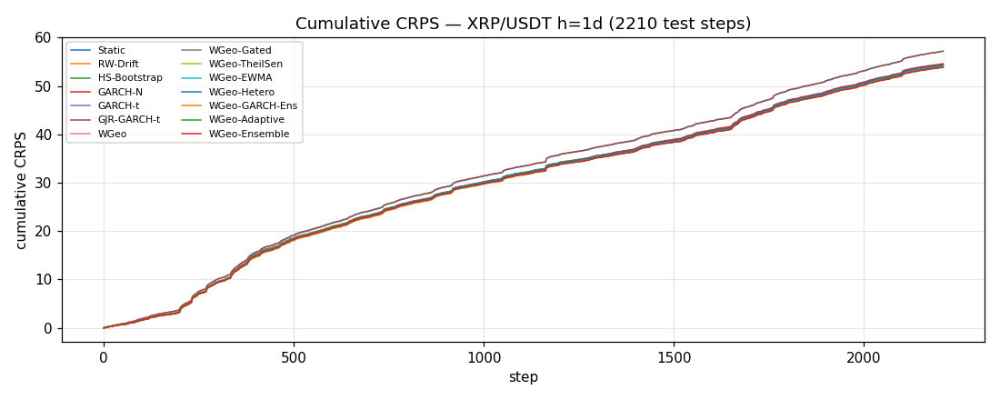
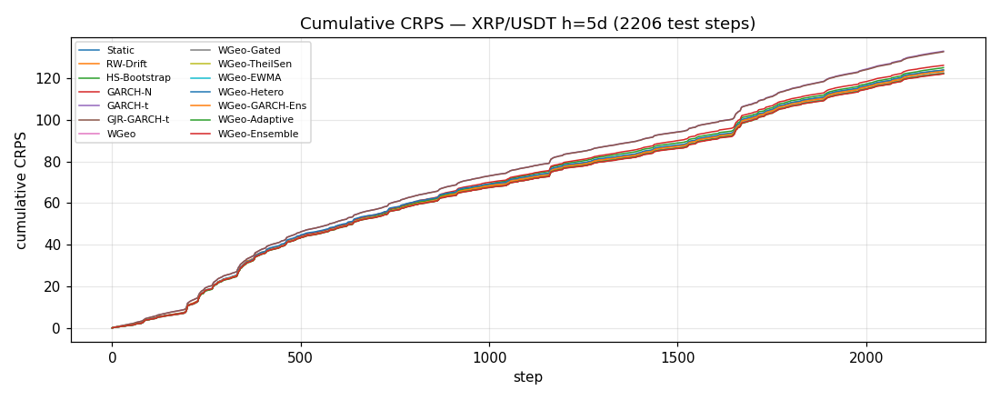
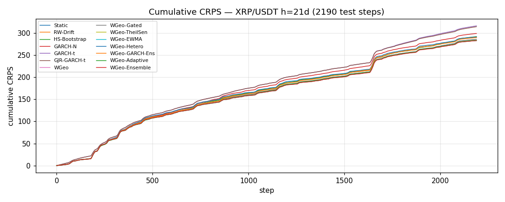

# Long-Horizon Results — Multi-Year, Multi-Asset Validation

Goal: prove the Wasserstein-Geodesic forecaster works over a *long* time horizon.
Train: rolling 730-day window. Test: every day after burn-in (no separate holdout).
Scoring: CRPS (lower better, strictly proper).

## Pre-registration

**Pre-registered headline forecaster:** `WGeo-Ensemble` (the equal-weight W₂ barycentre of `WGeo-TheilSen`, `WGeo-EWMA`, `WGeo-Gated` — see `THEORY.md §2.9`). All headline DM tests below are `WGeo-Ensemble` against a fixed reference baseline. The previous reporting style — *best-of-family vs best-of-baseline* — is retained as a robustness appendix because the implicit max-over-comparators inflates type-I error and is not a valid pre-committed test.

**Pre-registered reference baselines:** `Static`, `GARCH-N`. `Static` is the most naive distributional baseline (the current empirical quantile, √h-scaled); `GARCH-N` is the standard parametric vol baseline from the econometrics canon. A win against both is the minimum bar for the v0.5 claim.

## Headline 1 — WGeo-Ensemble vs Static (pre-registered)

| symbol   |   h |   n_test | baseline   |   ensemble_crps |   baseline_crps | improvement   |   dm_stat |   dm_p |   dm_stat_r |   dm_p_r |
|:---------|----:|---------:|:-----------|----------------:|----------------:|:--------------|----------:|-------:|------------:|---------:|
| BTC/USDT |   1 |     2470 | Static     |        0.016168 |        0.016236 | -0.4%         |     -1.71 | 0.0871 |       -1.8  |   0.072  |
| BTC/USDT |   5 |     2466 | Static     |        0.037061 |        0.037367 | -0.8%         |     -1.97 | 0.0491 |       -2.71 |   0.0067 |
| BTC/USDT |  21 |     2450 | Static     |        0.083158 |        0.085347 | -2.6%         |     -1.78 | 0.0756 |       -4.6  |   0      |
| ETH/USDT |   1 |     2470 | Static     |        0.021739 |        0.021897 | -0.7%         |     -3.02 | 0.0025 |       -3.28 |   0.001  |
| ETH/USDT |   5 |     2466 | Static     |        0.049256 |        0.049834 | -1.2%         |     -2.73 | 0.0064 |       -4.02 |   0.0001 |
| ETH/USDT |  21 |     2450 | Static     |        0.109816 |        0.113701 | -3.4%         |     -2.28 | 0.0227 |       -7.27 |   0      |
| SOL/USDT |   1 |     1380 | Static     |        0.02503  |        0.025075 | -0.2%         |     -0.55 | 0.5839 |       -0.6  |   0.5502 |
| SOL/USDT |   5 |     1376 | Static     |        0.057153 |        0.057622 | -0.8%         |     -1.41 | 0.1588 |       -1.81 |   0.0706 |
| SOL/USDT |  21 |     1360 | Static     |        0.129833 |        0.134406 | -3.4%         |     -1.94 | 0.0529 |       -5.08 |   0      |
| BNB/USDT |   1 |     2389 | Static     |        0.020144 |        0.020339 | -1.0%         |     -3.33 | 0.0009 |       -3.83 |   0.0001 |
| BNB/USDT |   5 |     2385 | Static     |        0.045782 |        0.046297 | -1.1%         |     -2.2  | 0.0281 |       -2.96 |   0.0031 |
| BNB/USDT |  21 |     2369 | Static     |        0.102619 |        0.105553 | -2.8%         |     -1.55 | 0.12   |       -3.81 |   0.0001 |
| XRP/USDT |   1 |     2210 | Static     |        0.024359 |        0.024566 | -0.8%         |     -2.9  | 0.0038 |       -3.3  |   0.001  |
| XRP/USDT |   5 |     2206 | Static     |        0.055389 |        0.056199 | -1.4%         |     -3.15 | 0.0017 |       -3.77 |   0.0002 |
| XRP/USDT |  21 |     2190 | Static     |        0.129103 |        0.132709 | -2.7%         |     -3.17 | 0.0015 |       -4.21 |   0      |

## Headline 2 — WGeo-Ensemble vs GARCH-N (pre-registered)

| symbol   |   h |   n_test | baseline   |   ensemble_crps |   baseline_crps | improvement   |   dm_stat |   dm_p |   dm_stat_r |   dm_p_r |
|:---------|----:|---------:|:-----------|----------------:|----------------:|:--------------|----------:|-------:|------------:|---------:|
| BTC/USDT |   1 |     2470 | GARCH-N    |        0.016168 |        0.016463 | -1.8%         |     -5.08 | 0      |       -7.16 |   0      |
| BTC/USDT |   5 |     2466 | GARCH-N    |        0.037061 |        0.037807 | -2.0%         |     -3.15 | 0.0016 |       -5.93 |   0      |
| BTC/USDT |  21 |     2450 | GARCH-N    |        0.083158 |        0.084848 | -2.0%         |     -0.84 | 0.4009 |       -2.48 |   0.013  |
| ETH/USDT |   1 |     2470 | GARCH-N    |        0.021739 |        0.021947 | -0.9%         |     -2.85 | 0.0044 |       -4.03 |   0.0001 |
| ETH/USDT |   5 |     2466 | GARCH-N    |        0.049256 |        0.050368 | -2.2%         |     -4.04 | 0.0001 |       -7.13 |   0      |
| ETH/USDT |  21 |     2450 | GARCH-N    |        0.109816 |        0.11297  | -2.8%         |     -1.5  | 0.1337 |       -4.47 |   0      |
| SOL/USDT |   1 |     1380 | GARCH-N    |        0.02503  |        0.025219 | -0.7%         |     -1.7  | 0.0894 |       -2.37 |   0.0177 |
| SOL/USDT |   5 |     1376 | GARCH-N    |        0.057153 |        0.058296 | -2.0%         |     -2.93 | 0.0034 |       -4.34 |   0      |
| SOL/USDT |  21 |     1360 | GARCH-N    |        0.129833 |        0.133568 | -2.8%         |     -1.62 | 0.1043 |       -4.07 |   0      |
| BNB/USDT |   1 |     2389 | GARCH-N    |        0.020144 |        0.020199 | -0.3%         |     -0.61 | 0.5433 |       -1.03 |   0.3018 |
| BNB/USDT |   5 |     2385 | GARCH-N    |        0.045782 |        0.046475 | -1.5%         |     -2.2  | 0.0278 |       -3.83 |   0.0001 |
| BNB/USDT |  21 |     2369 | GARCH-N    |        0.102619 |        0.105595 | -2.8%         |     -1.73 | 0.0845 |       -3.37 |   0.0008 |
| XRP/USDT |   1 |     2210 | GARCH-N    |        0.024359 |        0.024697 | -1.4%         |     -2.69 | 0.0071 |       -4.1  |   0      |
| XRP/USDT |   5 |     2206 | GARCH-N    |        0.055389 |        0.057258 | -3.3%         |     -4.51 | 0      |       -6.29 |   0      |
| XRP/USDT |  21 |     2190 | GARCH-N    |        0.129103 |        0.136474 | -5.4%         |     -3.5  | 0.0005 |       -4.79 |   0      |

*`dm_p` is the classic Diebold-Mariano (1995) p-value; `dm_p_r` is the variance-reduced residualised DM with the `full` control set (vol moments + four peer-method loss series) — a Giacomini-White-style augmented test of the same unconditional EPA null. See the sensitivity table below for the breakdown by control set, and `docs/THEORY.md §2.10` for the math.*

## Residualised-DM sensitivity to control set

The residualised DM test admits any covariate predictable at time t. Three control sets are reported, ordered from least to most powerful: `none` (= vanilla DM), `vol` (`[y, |y|, y²]` — sign, magnitude, and kurtosis-like moment of the realised return), and `full` (`vol` plus up to four peer-method loss series). Peer-loss controls are admissible under Giacomini-White but rhetorically more endogenous; the table below decomposes the residualised lift so the reader can see how much is driven by vol controls alone vs. peer losses.

**Aggregate — cells with `dm_p < 0.05` and `WGeo-Ensemble` lower CRPS:**

| baseline   |   cells | no_controls   | vol_only   | vol_plus_peers   |
|:-----------|--------:|:--------------|:-----------|:-----------------|
| Static     |      15 | 9/15          | 12/15      | 12/15            |
| GARCH-N    |      15 | 9/15          | 12/15      | 14/15            |

The pre-registered falsification threshold in `PREREGISTRATION.md` is anchored to the `vol_only` column so the v0.5 bar does not depend on peer-loss correlations — peer losses are reported as a power-only bonus, not a contributor to the headline claim.

**Per-cell residualised-DM p-values:**

| symbol   |   h | baseline   |   dm_p_none |   dm_p_vol |   dm_p_full |
|:---------|----:|:-----------|------------:|-----------:|------------:|
| BTC/USDT |   1 | Static     |      0.0871 |     0.0862 |      0.072  |
| BTC/USDT |   1 | GARCH-N    |      0      |     0      |      0      |
| BTC/USDT |   5 | Static     |      0.0491 |     0.0211 |      0.0067 |
| BTC/USDT |   5 | GARCH-N    |      0.0016 |     0      |      0      |
| BTC/USDT |  21 | Static     |      0.0756 |     0.01   |      0      |
| BTC/USDT |  21 | GARCH-N    |      0.4009 |     0.1107 |      0.013  |
| ETH/USDT |   1 | Static     |      0.0025 |     0.0025 |      0.001  |
| ETH/USDT |   1 | GARCH-N    |      0.0044 |     0.0009 |      0.0001 |
| ETH/USDT |   5 | Static     |      0.0064 |     0.0033 |      0.0001 |
| ETH/USDT |   5 | GARCH-N    |      0.0001 |     0      |      0      |
| ETH/USDT |  21 | Static     |      0.0227 |     0.007  |      0      |
| ETH/USDT |  21 | GARCH-N    |      0.1337 |     0.0362 |      0      |
| SOL/USDT |   1 | Static     |      0.5839 |     0.5613 |      0.5502 |
| SOL/USDT |   1 | GARCH-N    |      0.0894 |     0.0563 |      0.0177 |
| SOL/USDT |   5 | Static     |      0.1588 |     0.1391 |      0.0706 |
| SOL/USDT |   5 | GARCH-N    |      0.0034 |     0.0007 |      0      |
| SOL/USDT |  21 | Static     |      0.0529 |     0.0364 |      0      |
| SOL/USDT |  21 | GARCH-N    |      0.1043 |     0.0306 |      0      |
| BNB/USDT |   1 | Static     |      0.0009 |     0.0005 |      0.0001 |
| BNB/USDT |   1 | GARCH-N    |      0.5433 |     0.4857 |      0.3018 |
| BNB/USDT |   5 | Static     |      0.0281 |     0.0156 |      0.0031 |
| BNB/USDT |   5 | GARCH-N    |      0.0278 |     0.0105 |      0.0001 |
| BNB/USDT |  21 | Static     |      0.12   |     0.032  |      0.0001 |
| BNB/USDT |  21 | GARCH-N    |      0.0845 |     0.0233 |      0.0008 |
| XRP/USDT |   1 | Static     |      0.0038 |     0.0025 |      0.001  |
| XRP/USDT |   1 | GARCH-N    |      0.0071 |     0.0022 |      0      |
| XRP/USDT |   5 | Static     |      0.0017 |     0.0009 |      0.0002 |
| XRP/USDT |   5 | GARCH-N    |      0      |     0      |      0      |
| XRP/USDT |  21 | Static     |      0.0015 |     0.0005 |      0      |
| XRP/USDT |  21 | GARCH-N    |      0.0005 |     0      |      0      |

## Robustness — best WGeo-family vs best non-WGeo baseline (legacy)

Retained for continuity with v0.3 / v0.4 reporting. Both sides are selected by minimum cell CRPS, so the implicit multiple comparison (8 WGeo variants × 6 baselines = 48 implicit pairs per cell) inflates type-I error. Use Headlines 1–2 above for inference; this table is a robustness check that the pre-registered headline does not depend on the choice of WGeo variant.

| symbol   |   h |   n_test | best_wgeo     | best_baseline   |   wgeo_crps |   baseline_crps | improvement   |   dm_stat |   dm_p |   dm_stat_r |   dm_p_r | hetero_garch_fallback   |
|:---------|----:|---------:|:--------------|:----------------|------------:|----------------:|:--------------|----------:|-------:|------------:|---------:|:------------------------|
| BTC/USDT |   1 |     2470 | WGeo-Ensemble | Static          |    0.016168 |        0.016236 | -0.4%         |     -1.71 | 0.0871 |       -1.8  |   0.072  | 0.0%                    |
| BTC/USDT |   5 |     2466 | WGeo-Ensemble | Static          |    0.037061 |        0.037367 | -0.8%         |     -1.97 | 0.0491 |       -2.71 |   0.0067 | 0.0%                    |
| BTC/USDT |  21 |     2450 | WGeo-Ensemble | GARCH-N         |    0.083158 |        0.084848 | -2.0%         |     -0.84 | 0.4009 |       -2.48 |   0.013  | 0.0%                    |
| ETH/USDT |   1 |     2470 | WGeo-Ensemble | HS-Bootstrap    |    0.021739 |        0.021893 | -0.7%         |     -2.97 | 0.003  |       -3.19 |   0.0014 | 0.0%                    |
| ETH/USDT |   5 |     2466 | WGeo-Ensemble | Static          |    0.049256 |        0.049834 | -1.2%         |     -2.73 | 0.0064 |       -4.02 |   0.0001 | 0.0%                    |
| ETH/USDT |  21 |     2450 | WGeo-TheilSen | GARCH-N         |    0.109404 |        0.11297  | -3.2%         |     -1.42 | 0.1559 |       -4.43 |   0      | 0.0%                    |
| SOL/USDT |   1 |     1380 | WGeo-Ensemble | Static          |    0.02503  |        0.025075 | -0.2%         |     -0.55 | 0.5839 |       -0.6  |   0.5502 | 0.0%                    |
| SOL/USDT |   5 |     1376 | WGeo-Ensemble | Static          |    0.057153 |        0.057622 | -0.8%         |     -1.41 | 0.1588 |       -1.81 |   0.0706 | 0.0%                    |
| SOL/USDT |  21 |     1360 | WGeo-Adaptive | GARCH-N         |    0.129263 |        0.133568 | -3.2%         |     -1.49 | 0.137  |       -3.75 |   0.0002 | 0.0%                    |
| BNB/USDT |   1 |     2389 | WGeo-Ensemble | GARCH-N         |    0.020144 |        0.020199 | -0.3%         |     -0.61 | 0.5433 |       -1.03 |   0.3018 | 0.0%                    |
| BNB/USDT |   5 |     2385 | WGeo-Ensemble | Static          |    0.045782 |        0.046297 | -1.1%         |     -2.2  | 0.0281 |       -2.96 |   0.0031 | 0.0%                    |
| BNB/USDT |  21 |     2369 | WGeo-Ensemble | Static          |    0.102619 |        0.105553 | -2.8%         |     -1.55 | 0.12   |       -3.81 |   0.0001 | 0.0%                    |
| XRP/USDT |   1 |     2210 | WGeo-Ensemble | HS-Bootstrap    |    0.024359 |        0.024548 | -0.8%         |     -2.69 | 0.0072 |       -3.01 |   0.0026 | 0.0%                    |
| XRP/USDT |   5 |     2206 | WGeo-Ensemble | Static          |    0.055389 |        0.056199 | -1.4%         |     -3.15 | 0.0017 |       -3.77 |   0.0002 | 0.0%                    |
| XRP/USDT |  21 |     2190 | WGeo-Ensemble | Static          |    0.129103 |        0.132709 | -2.7%         |     -3.17 | 0.0015 |       -4.21 |   0      | 0.0%                    |

## BTC/USDT

_3201 days from 2017-08-18 to 2026-05-23_

### Horizon h = 1 day(s)

**Overall mean CRPS on the full test span (bootstrap 95% CI):**

| method         |    n |   mean_crps |    ci_lo |    ci_hi |   garch_fallback |
|:---------------|-----:|------------:|---------:|---------:|-----------------:|
| Static         | 2470 |    0.016236 | 0.015385 | 0.017189 |              nan |
| RW-Drift       | 2470 |    0.016236 | 0.015385 | 0.017189 |              nan |
| HS-Bootstrap   | 2470 |    0.016239 | 0.015385 | 0.017187 |              nan |
| GARCH-N        | 2470 |    0.016463 | 0.015635 | 0.017398 |              nan |
| GARCH-t        | 2470 |    0.017178 | 0.016407 | 0.018085 |              nan |
| GJR-GARCH-t    | 2470 |    0.017176 | 0.016402 | 0.01807  |              nan |
| WGeo           | 2470 |    0.016212 | 0.015309 | 0.017195 |              nan |
| WGeo-Gated     | 2470 |    0.016203 | 0.015338 | 0.017167 |              nan |
| WGeo-TheilSen  | 2470 |    0.016212 | 0.015309 | 0.017196 |              nan |
| WGeo-EWMA      | 2470 |    0.016212 | 0.01531  | 0.017196 |              nan |
| WGeo-Hetero    | 2470 |    0.016221 | 0.01532  | 0.017198 |                0 |
| WGeo-GARCH-Ens | 2470 |    0.016253 | 0.015388 | 0.017222 |              nan |
| WGeo-Adaptive  | 2470 |    0.016238 | 0.01535  | 0.017206 |              nan |
| WGeo-Ensemble  | 2470 |    0.016168 | 0.015281 | 0.017139 |              nan |

**Per-year mean CRPS:**

|   year |   n |   Static |   RW-Drift |   HS-Bootstrap |   GARCH-N |   GARCH-t |   GJR-GARCH-t |    WGeo |   WGeo-Gated |   WGeo-TheilSen |   WGeo-EWMA |   WGeo-Hetero |   WGeo-GARCH-Ens |   WGeo-Adaptive |   WGeo-Ensemble |
|-------:|----:|---------:|-----------:|---------------:|----------:|----------:|--------------:|--------:|-------------:|----------------:|------------:|--------------:|-----------------:|----------------:|----------------:|
|   2019 | 136 |  0.01618 |    0.01618 |        0.01617 |   0.01638 |   0.01678 |       0.01675 | 0.01607 |      0.01604 |         0.01607 |     0.01607 |       0.01591 |          0.01618 |         0.016   |         0.01601 |
|   2020 | 366 |  0.01871 |    0.01871 |        0.01871 |   0.01923 |   0.02034 |       0.02032 | 0.01872 |      0.01874 |         0.01872 |     0.01873 |       0.01872 |          0.01888 |         0.01871 |         0.0187  |
|   2021 | 365 |  0.02337 |    0.02337 |        0.02335 |   0.02331 |   0.02402 |       0.024   | 0.02344 |      0.02342 |         0.02344 |     0.02344 |       0.02341 |          0.0233  |         0.02344 |         0.02338 |
|   2022 | 365 |  0.01752 |    0.01752 |        0.01753 |   0.01788 |   0.01854 |       0.01845 | 0.01732 |      0.01734 |         0.01732 |     0.01732 |       0.01736 |          0.01742 |         0.01745 |         0.01728 |
|   2023 | 365 |  0.01227 |    0.01227 |        0.01227 |   0.01267 |   0.01312 |       0.01309 | 0.01202 |      0.01214 |         0.01202 |     0.01202 |       0.01208 |          0.01212 |         0.01202 |         0.01199 |
|   2024 | 366 |  0.01487 |    0.01487 |        0.01487 |   0.01496 |   0.01604 |       0.01604 | 0.01499 |      0.0149  |         0.01499 |     0.01499 |       0.01504 |          0.015   |         0.01503 |         0.01494 |
|   2025 | 365 |  0.01173 |    0.01173 |        0.01176 |   0.01181 |   0.01236 |       0.0125  | 0.01177 |      0.01173 |         0.01177 |     0.01177 |       0.01176 |          0.01174 |         0.01182 |         0.01173 |
|   2026 | 142 |  0.01357 |    0.01357 |        0.01359 |   0.01375 |   0.01409 |       0.0141  | 0.01379 |      0.01362 |         0.01379 |     0.01379 |       0.01382 |          0.01391 |         0.01379 |         0.01372 |

**Per-regime mean CRPS (regime tagged from 60d trailing return + vol):**

| regime   |    n |   Static |   RW-Drift |   HS-Bootstrap |   GARCH-N |   GARCH-t |   GJR-GARCH-t |    WGeo |   WGeo-Gated |   WGeo-TheilSen |   WGeo-EWMA |   WGeo-Hetero |   WGeo-GARCH-Ens |   WGeo-Adaptive |   WGeo-Ensemble |
|:---------|-----:|---------:|-----------:|---------------:|----------:|----------:|--------------:|--------:|-------------:|----------------:|------------:|--------------:|-----------------:|----------------:|----------------:|
| crash    |  320 |  0.02104 |    0.02104 |        0.02104 |   0.02132 |   0.02242 |       0.02236 | 0.02116 |      0.02102 |         0.02116 |     0.02116 |       0.02107 |          0.02121 |         0.02127 |         0.02107 |
| high-vol |   69 |  0.01877 |    0.01877 |        0.01871 |   0.0189  |   0.02016 |       0.02018 | 0.01932 |      0.01891 |         0.01933 |     0.01932 |       0.01927 |          0.01947 |         0.01906 |         0.01915 |
| neutral  | 1047 |  0.01542 |    0.01542 |        0.01543 |   0.01573 |   0.01643 |       0.0164  | 0.01531 |      0.01535 |         0.01531 |     0.01531 |       0.01532 |          0.0154  |         0.01534 |         0.01529 |
| low-vol  |  498 |  0.01212 |    0.01212 |        0.01213 |   0.01231 |   0.01262 |       0.0127  | 0.01193 |      0.01205 |         0.01193 |     0.01193 |       0.01197 |          0.01193 |         0.01194 |         0.01193 |
| rally    |  536 |  0.01846 |    0.01846 |        0.01845 |   0.01855 |   0.01936 |       0.01937 | 0.01859 |      0.01851 |         0.01859 |     0.01859 |       0.01865 |          0.01856 |         0.01861 |         0.01851 |

**Diebold-Mariano vs Static** (headline best WGeo-family variant is **WGeo-Ensemble**; both vanilla and residualised tests reported — residualised uses |y|, y², y plus 4 peer losses as controls to project out shared volatility-clustering noise):

|                |   p_vanilla |   p_residualised |
|:---------------|------------:|-----------------:|
| Static         |      1      |           1      |
| RW-Drift       |      1      |           1      |
| HS-Bootstrap   |      0.7195 |           0.7174 |
| GARCH-N        |      0      |           0      |
| GARCH-t        |      0      |           0      |
| GJR-GARCH-t    |      0      |           0      |
| WGeo           |      0.6169 |           0.5971 |
| WGeo-Gated     |      0.2185 |           0.2084 |
| WGeo-TheilSen  |      0.6152 |           0.5955 |
| WGeo-EWMA      |      0.6261 |           0.6067 |
| WGeo-Hetero    |      0.795  |           0.7398 |
| WGeo-GARCH-Ens |      0.7659 |           0.6424 |
| WGeo-Adaptive  |      0.9811 |           0.9792 |
| WGeo-Ensemble  |      0.0871 |           0.072  |

**Regime-conditional DM** (WGeo-Ensemble vs Static, per-regime CRPS gap and DM statistic; the aggregate panel DM hides large WGeo-family wins in non-neutral regimes):

| regime   |    n |   mean_a |   mean_b |   delta_pct |       dm |       p |
|:---------|-----:|---------:|---------:|------------:|---------:|--------:|
| crash    |  320 |  0.02107 |  0.02104 |     0.14119 |  0.20684 | 0.83613 |
| high-vol |   69 |  0.01915 |  0.01877 |     2.01953 |  1.87661 | 0.06057 |
| neutral  | 1047 |  0.01529 |  0.01542 |    -0.83294 | -2.58344 | 0.00978 |
| low-vol  |  498 |  0.01193 |  0.01212 |    -1.57101 | -3.12695 | 0.00177 |
| rally    |  536 |  0.01851 |  0.01846 |     0.26063 |  0.42678 | 0.66954 |

**GARCH-fallback rate** (fraction of walk-forward steps where the GARCH fit raised or produced degenerate variances, forcing the WGeo-Hetero / CondShape variants back onto the unconditional √h scaling). The §4 falsification floor for Hetero is conditional on this rate being small — otherwise the headline is measuring √h scaling, not the GARCH contribution:

| method      |   fallback_rate |
|:------------|----------------:|
| WGeo-Hetero |               0 |

### Horizon h = 5 day(s)

**Overall mean CRPS on the full test span (bootstrap 95% CI):**

| method         |    n |   mean_crps |    ci_lo |    ci_hi |   garch_fallback |
|:---------------|-----:|------------:|---------:|---------:|-----------------:|
| Static         | 2466 |    0.037367 | 0.034483 | 0.040159 |              nan |
| RW-Drift       | 2466 |    0.037367 | 0.034483 | 0.040159 |              nan |
| HS-Bootstrap   | 2466 |    0.037565 | 0.034801 | 0.040252 |              nan |
| GARCH-N        | 2466 |    0.037807 | 0.035025 | 0.040469 |              nan |
| GARCH-t        | 2466 |    0.039544 | 0.036965 | 0.042101 |              nan |
| GJR-GARCH-t    | 2466 |    0.039547 | 0.036949 | 0.042129 |              nan |
| WGeo           | 2466 |    0.037137 | 0.034299 | 0.039989 |              nan |
| WGeo-Gated     | 2466 |    0.037228 | 0.034353 | 0.040014 |              nan |
| WGeo-TheilSen  | 2466 |    0.037135 | 0.034298 | 0.039985 |              nan |
| WGeo-EWMA      | 2466 |    0.03714  | 0.034304 | 0.039995 |              nan |
| WGeo-Hetero    | 2466 |    0.037333 | 0.034447 | 0.040179 |                0 |
| WGeo-GARCH-Ens | 2466 |    0.037363 | 0.034455 | 0.040212 |              nan |
| WGeo-Adaptive  | 2466 |    0.037228 | 0.034377 | 0.040019 |              nan |
| WGeo-Ensemble  | 2466 |    0.037061 | 0.034167 | 0.039886 |              nan |

**Per-year mean CRPS:**

|   year |   n |   Static |   RW-Drift |   HS-Bootstrap |   GARCH-N |   GARCH-t |   GJR-GARCH-t |    WGeo |   WGeo-Gated |   WGeo-TheilSen |   WGeo-EWMA |   WGeo-Hetero |   WGeo-GARCH-Ens |   WGeo-Adaptive |   WGeo-Ensemble |
|-------:|----:|---------:|-----------:|---------------:|----------:|----------:|--------------:|--------:|-------------:|----------------:|------------:|--------------:|-----------------:|----------------:|----------------:|
|   2019 | 136 |  0.0374  |    0.0374  |        0.03887 |   0.03838 |   0.03973 |       0.03965 | 0.03661 |      0.03687 |         0.0366  |     0.03661 |       0.0368  |          0.03715 |         0.03691 |         0.03658 |
|   2020 | 366 |  0.04447 |    0.04447 |        0.04434 |   0.04471 |   0.04784 |       0.04775 | 0.04563 |      0.0448  |         0.04565 |     0.04563 |       0.04586 |          0.04538 |         0.0451  |         0.04525 |
|   2021 | 365 |  0.05182 |    0.05182 |        0.05125 |   0.05199 |   0.05313 |       0.05299 | 0.05093 |      0.05158 |         0.05094 |     0.05093 |       0.05098 |          0.05125 |         0.05121 |         0.05104 |
|   2022 | 365 |  0.04128 |    0.04128 |        0.04187 |   0.04223 |   0.04362 |       0.0435  | 0.04003 |      0.04062 |         0.04001 |     0.04002 |       0.04037 |          0.04051 |         0.04055 |         0.04009 |
|   2023 | 365 |  0.03012 |    0.03012 |        0.0311  |   0.03108 |   0.03206 |       0.03204 | 0.02978 |      0.02996 |         0.02978 |     0.02979 |       0.03004 |          0.03024 |         0.0298  |         0.02965 |
|   2024 | 366 |  0.03463 |    0.03463 |        0.03411 |   0.03424 |   0.03726 |       0.03745 | 0.03497 |      0.03481 |         0.03496 |     0.03498 |       0.03511 |          0.03482 |         0.03497 |         0.03487 |
|   2025 | 365 |  0.02536 |    0.02536 |        0.02573 |   0.02576 |   0.02692 |       0.02716 | 0.02511 |      0.02526 |         0.02512 |     0.02513 |       0.02519 |          0.0252  |         0.02529 |         0.02509 |
|   2026 | 138 |  0.0281  |    0.0281  |        0.02829 |   0.02884 |   0.02988 |       0.02983 | 0.02801 |      0.02785 |         0.028   |     0.028   |       0.0284  |          0.02903 |         0.02812 |         0.02792 |

**Per-regime mean CRPS (regime tagged from 60d trailing return + vol):**

| regime   |    n |   Static |   RW-Drift |   HS-Bootstrap |   GARCH-N |   GARCH-t |   GJR-GARCH-t |    WGeo |   WGeo-Gated |   WGeo-TheilSen |   WGeo-EWMA |   WGeo-Hetero |   WGeo-GARCH-Ens |   WGeo-Adaptive |   WGeo-Ensemble |
|:---------|-----:|---------:|-----------:|---------------:|----------:|----------:|--------------:|--------:|-------------:|----------------:|------------:|--------------:|-----------------:|----------------:|----------------:|
| crash    |  320 |  0.04373 |    0.04373 |        0.04362 |   0.04527 |   0.04816 |       0.04786 | 0.04401 |      0.04362 |         0.044   |     0.04401 |       0.04461 |          0.04513 |         0.04475 |         0.04377 |
| high-vol |   69 |  0.04774 |    0.04774 |        0.04678 |   0.04537 |   0.04926 |       0.0493  | 0.0479  |      0.04806 |         0.0479  |     0.04788 |       0.04782 |          0.04813 |         0.04779 |         0.04783 |
| neutral  | 1047 |  0.03678 |    0.03678 |        0.03727 |   0.0373  |   0.03903 |       0.03905 | 0.03624 |      0.03651 |         0.03623 |     0.03625 |       0.03642 |          0.03653 |         0.0364  |         0.03624 |
| low-vol  |  494 |  0.03028 |    0.03028 |        0.0307  |   0.03073 |   0.0311  |       0.03126 | 0.02974 |      0.03007 |         0.02973 |     0.02974 |       0.02996 |          0.02991 |         0.02982 |         0.02973 |
| rally    |  536 |  0.03991 |    0.03991 |        0.03967 |   0.03989 |   0.04195 |       0.04193 | 0.04022 |      0.04001 |         0.04023 |     0.04023 |       0.04022 |          0.03983 |         0.03983 |         0.04003 |

**Diebold-Mariano vs Static** (headline best WGeo-family variant is **WGeo-Ensemble**; both vanilla and residualised tests reported — residualised uses |y|, y², y plus 4 peer losses as controls to project out shared volatility-clustering noise):

|                |   p_vanilla |   p_residualised |
|:---------------|------------:|-----------------:|
| Static         |      1      |           1      |
| RW-Drift       |      1      |           1      |
| HS-Bootstrap   |      0.0465 |           0      |
| GARCH-N        |      0.0132 |           0      |
| GARCH-t        |      0      |           0      |
| GJR-GARCH-t    |      0      |           0      |
| WGeo           |      0.2388 |           0.1052 |
| WGeo-Gated     |      0.1458 |           0.0736 |
| WGeo-TheilSen  |      0.2344 |           0.1012 |
| WGeo-EWMA      |      0.2466 |           0.1107 |
| WGeo-Hetero    |      0.8767 |           0.8184 |
| WGeo-GARCH-Ens |      0.9834 |           0.9779 |
| WGeo-Adaptive  |      0.5114 |           0.3636 |
| WGeo-Ensemble  |      0.0491 |           0.0067 |

**Regime-conditional DM** (WGeo-Ensemble vs Static, per-regime CRPS gap and DM statistic; the aggregate panel DM hides large WGeo-family wins in non-neutral regimes):

| regime   |    n |   mean_a |   mean_b |   delta_pct |       dm |       p |
|:---------|-----:|---------:|---------:|------------:|---------:|--------:|
| crash    |  320 |  0.04377 |  0.04373 |     0.08413 |  0.06312 | 0.94967 |
| high-vol |   69 |  0.04783 |  0.04774 |     0.19757 |  0.21828 | 0.82721 |
| neutral  | 1047 |  0.03624 |  0.03678 |    -1.45261 | -2.38996 | 0.01685 |
| low-vol  |  494 |  0.02973 |  0.03028 |    -1.84222 | -1.87781 | 0.06041 |
| rally    |  536 |  0.04003 |  0.03991 |     0.28801 |  0.38306 | 0.70167 |

**GARCH-fallback rate** (fraction of walk-forward steps where the GARCH fit raised or produced degenerate variances, forcing the WGeo-Hetero / CondShape variants back onto the unconditional √h scaling). The §4 falsification floor for Hetero is conditional on this rate being small — otherwise the headline is measuring √h scaling, not the GARCH contribution:

| method      |   fallback_rate |
|:------------|----------------:|
| WGeo-Hetero |               0 |

### Horizon h = 21 day(s)

**Overall mean CRPS on the full test span (bootstrap 95% CI):**

| method         |    n |   mean_crps |    ci_lo |    ci_hi |   garch_fallback |
|:---------------|-----:|------------:|---------:|---------:|-----------------:|
| Static         | 2450 |    0.085347 | 0.075667 | 0.095899 |              nan |
| RW-Drift       | 2450 |    0.085347 | 0.075667 | 0.095899 |              nan |
| HS-Bootstrap   | 2450 |    0.085057 | 0.076106 | 0.094639 |              nan |
| GARCH-N        | 2450 |    0.084848 | 0.075685 | 0.09484  |              nan |
| GARCH-t        | 2450 |    0.089412 | 0.080782 | 0.099096 |              nan |
| GJR-GARCH-t    | 2450 |    0.089596 | 0.08085  | 0.099366 |              nan |
| WGeo           | 2450 |    0.083313 | 0.07345  | 0.094259 |              nan |
| WGeo-Gated     | 2450 |    0.084033 | 0.074379 | 0.094524 |              nan |
| WGeo-TheilSen  | 2450 |    0.083296 | 0.073428 | 0.094273 |              nan |
| WGeo-EWMA      | 2450 |    0.083317 | 0.073446 | 0.094264 |              nan |
| WGeo-Hetero    | 2450 |    0.083683 | 0.073814 | 0.094527 |                0 |
| WGeo-GARCH-Ens | 2450 |    0.083394 | 0.073873 | 0.093618 |              nan |
| WGeo-Adaptive  | 2450 |    0.083908 | 0.074175 | 0.094437 |              nan |
| WGeo-Ensemble  | 2450 |    0.083158 | 0.073451 | 0.093473 |              nan |

**Per-year mean CRPS:**

|   year |   n |   Static |   RW-Drift |   HS-Bootstrap |   GARCH-N |   GARCH-t |   GJR-GARCH-t |    WGeo |   WGeo-Gated |   WGeo-TheilSen |   WGeo-EWMA |   WGeo-Hetero |   WGeo-GARCH-Ens |   WGeo-Adaptive |   WGeo-Ensemble |
|-------:|----:|---------:|-----------:|---------------:|----------:|----------:|--------------:|--------:|-------------:|----------------:|------------:|--------------:|-----------------:|----------------:|----------------:|
|   2019 | 136 |  0.08773 |    0.08773 |        0.08765 |   0.0851  |   0.08835 |       0.08821 | 0.08209 |      0.08528 |         0.08207 |     0.08198 |       0.08337 |          0.08103 |         0.08517 |         0.08289 |
|   2020 | 366 |  0.11632 |    0.11632 |        0.11286 |   0.10853 |   0.11922 |       0.1192  | 0.12736 |      0.11945 |         0.12745 |     0.12731 |       0.12718 |          0.12165 |         0.12511 |         0.12433 |
|   2021 | 365 |  0.11083 |    0.11083 |        0.11034 |   0.11631 |   0.11448 |       0.1146  | 0.10423 |      0.10768 |         0.10427 |     0.10428 |       0.10475 |          0.1063  |         0.10518 |         0.10481 |
|   2022 | 365 |  0.09302 |    0.09302 |        0.09385 |   0.09556 |   0.09907 |       0.09944 | 0.08437 |      0.09001 |         0.08425 |     0.08439 |       0.08505 |          0.08556 |         0.08583 |         0.0858  |
|   2023 | 365 |  0.06819 |    0.06819 |        0.06984 |   0.06667 |   0.07118 |       0.07138 | 0.06498 |      0.06674 |         0.06497 |     0.06497 |       0.06509 |          0.06587 |         0.06534 |         0.06523 |
|   2024 | 366 |  0.07302 |    0.07302 |        0.0718  |   0.07104 |   0.0823  |       0.08239 | 0.07525 |      0.0732  |         0.07518 |     0.07534 |       0.07561 |          0.07571 |         0.07677 |         0.07428 |
|   2025 | 365 |  0.05322 |    0.05322 |        0.05388 |   0.05376 |   0.05453 |       0.05524 | 0.04795 |      0.0501  |         0.04797 |     0.04796 |       0.04809 |          0.04906 |         0.04814 |         0.04822 |
|   2026 | 122 |  0.075   |    0.075   |        0.07538 |   0.07614 |   0.07751 |       0.07698 | 0.07159 |      0.0735  |         0.0715  |     0.07154 |       0.0728  |          0.07448 |         0.07349 |         0.0721  |

**Per-regime mean CRPS (regime tagged from 60d trailing return + vol):**

| regime   |    n |   Static |   RW-Drift |   HS-Bootstrap |   GARCH-N |   GARCH-t |   GJR-GARCH-t |    WGeo |   WGeo-Gated |   WGeo-TheilSen |   WGeo-EWMA |   WGeo-Hetero |   WGeo-GARCH-Ens |   WGeo-Adaptive |   WGeo-Ensemble |
|:---------|-----:|---------:|-----------:|---------------:|----------:|----------:|--------------:|--------:|-------------:|----------------:|------------:|--------------:|-----------------:|----------------:|----------------:|
| crash    |  320 |  0.09161 |    0.09161 |        0.09133 |   0.09476 |   0.10099 |       0.10047 | 0.08674 |      0.08946 |         0.08669 |     0.08677 |       0.08839 |          0.0927  |         0.08891 |         0.08722 |
| high-vol |   69 |  0.0888  |    0.0888  |        0.08842 |   0.08359 |   0.10128 |       0.10125 | 0.09131 |      0.09065 |         0.09137 |     0.0913  |       0.09212 |          0.09299 |         0.09301 |         0.09092 |
| neutral  | 1047 |  0.08704 |    0.08704 |        0.08622 |   0.08557 |   0.09004 |       0.09032 | 0.08443 |      0.08572 |         0.0844  |     0.08443 |       0.08477 |          0.0851  |         0.08532 |         0.08446 |
| low-vol  |  478 |  0.07521 |    0.07521 |        0.07534 |   0.07431 |   0.07346 |       0.0737  | 0.06999 |      0.07227 |         0.06995 |     0.06995 |       0.07019 |          0.07092 |         0.07052 |         0.07035 |
| rally    |  536 |  0.0869  |    0.0869  |        0.08728 |   0.08707 |   0.09397 |       0.09437 | 0.08993 |      0.08714 |         0.08997 |     0.08997 |       0.0897  |          0.0844  |         0.08893 |         0.08862 |

**Diebold-Mariano vs GARCH-N** (headline best WGeo-family variant is **WGeo-Ensemble**; both vanilla and residualised tests reported — residualised uses |y|, y², y plus 4 peer losses as controls to project out shared volatility-clustering noise):

|                |   p_vanilla |   p_residualised |
|:---------------|------------:|-----------------:|
| Static         |      0.6713 |           0.2956 |
| RW-Drift       |      0.6713 |           0.2956 |
| HS-Bootstrap   |      0.7984 |           0.6665 |
| GARCH-N        |      1      |           1      |
| GARCH-t        |      0.0001 |           0      |
| GJR-GARCH-t    |      0.0001 |           0      |
| WGeo           |      0.5038 |           0.0521 |
| WGeo-Gated     |      0.5905 |           0.1584 |
| WGeo-TheilSen  |      0.4998 |           0.0484 |
| WGeo-EWMA      |      0.5047 |           0.0525 |
| WGeo-Hetero    |      0.6004 |           0.1475 |
| WGeo-GARCH-Ens |      0.4447 |           0.1982 |
| WGeo-Adaptive  |      0.6724 |           0.2372 |
| WGeo-Ensemble  |      0.4009 |           0.013  |

**Regime-conditional DM** (WGeo-Ensemble vs GARCH-N, per-regime CRPS gap and DM statistic; the aggregate panel DM hides large WGeo-family wins in non-neutral regimes):

| regime   |    n |   mean_a |   mean_b |   delta_pct |       dm |       p |
|:---------|-----:|---------:|---------:|------------:|---------:|--------:|
| crash    |  320 |  0.08722 |  0.09476 |    -7.96278 | -1.78534 | 0.07421 |
| high-vol |   69 |  0.09092 |  0.08359 |     8.76012 |  0.88293 | 0.37727 |
| neutral  | 1047 |  0.08446 |  0.08557 |    -1.30161 | -0.39947 | 0.68955 |
| low-vol  |  478 |  0.07035 |  0.07431 |    -5.32974 | -1.55432 | 0.12011 |
| rally    |  536 |  0.08862 |  0.08707 |     1.77728 |  0.30277 | 0.76207 |

**GARCH-fallback rate** (fraction of walk-forward steps where the GARCH fit raised or produced degenerate variances, forcing the WGeo-Hetero / CondShape variants back onto the unconditional √h scaling). The §4 falsification floor for Hetero is conditional on this rate being small — otherwise the headline is measuring √h scaling, not the GARCH contribution:

| method      |   fallback_rate |
|:------------|----------------:|
| WGeo-Hetero |               0 |

## ETH/USDT

_3201 days from 2017-08-18 to 2026-05-23_

### Horizon h = 1 day(s)

**Overall mean CRPS on the full test span (bootstrap 95% CI):**

| method         |    n |   mean_crps |    ci_lo |    ci_hi |   garch_fallback |
|:---------------|-----:|------------:|---------:|---------:|-----------------:|
| Static         | 2470 |    0.021897 | 0.020759 | 0.023146 |              nan |
| RW-Drift       | 2470 |    0.021897 | 0.020759 | 0.023146 |              nan |
| HS-Bootstrap   | 2470 |    0.021893 | 0.020755 | 0.023142 |              nan |
| GARCH-N        | 2470 |    0.021947 | 0.02087  | 0.023137 |              nan |
| GARCH-t        | 2470 |    0.022877 | 0.021852 | 0.02403  |              nan |
| GJR-GARCH-t    | 2470 |    0.022877 | 0.021859 | 0.024022 |              nan |
| WGeo           | 2470 |    0.021793 | 0.020641 | 0.023043 |              nan |
| WGeo-Gated     | 2470 |    0.021793 | 0.020634 | 0.023049 |              nan |
| WGeo-TheilSen  | 2470 |    0.021792 | 0.02064  | 0.023043 |              nan |
| WGeo-EWMA      | 2470 |    0.021792 | 0.02064  | 0.023041 |              nan |
| WGeo-Hetero    | 2470 |    0.021883 | 0.02075  | 0.0231   |                0 |
| WGeo-GARCH-Ens | 2470 |    0.021802 | 0.020723 | 0.023028 |              nan |
| WGeo-Adaptive  | 2470 |    0.021845 | 0.020689 | 0.023057 |              nan |
| WGeo-Ensemble  | 2470 |    0.021739 | 0.020585 | 0.022995 |              nan |

**Per-year mean CRPS:**

|   year |   n |   Static |   RW-Drift |   HS-Bootstrap |   GARCH-N |   GARCH-t |   GJR-GARCH-t |    WGeo |   WGeo-Gated |   WGeo-TheilSen |   WGeo-EWMA |   WGeo-Hetero |   WGeo-GARCH-Ens |   WGeo-Adaptive |   WGeo-Ensemble |
|-------:|----:|---------:|-----------:|---------------:|----------:|----------:|--------------:|--------:|-------------:|----------------:|------------:|--------------:|-----------------:|----------------:|----------------:|
|   2019 | 136 |  0.01926 |    0.01926 |        0.01924 |   0.01964 |   0.02149 |       0.02145 | 0.0188  |      0.01904 |         0.0188  |     0.0188  |       0.01881 |          0.01883 |         0.01902 |         0.01882 |
|   2020 | 366 |  0.02605 |    0.02605 |        0.02603 |   0.02644 |   0.0288  |       0.02878 | 0.02629 |      0.02607 |         0.02629 |     0.02629 |       0.02639 |          0.02639 |         0.02623 |         0.02617 |
|   2021 | 365 |  0.0306  |    0.0306  |        0.03058 |   0.03015 |   0.03049 |       0.03057 | 0.03048 |      0.03045 |         0.03048 |     0.03048 |       0.03033 |          0.03025 |         0.03051 |         0.03042 |
|   2022 | 365 |  0.02463 |    0.02463 |        0.02462 |   0.02476 |   0.02509 |       0.02512 | 0.02454 |      0.02453 |         0.02454 |     0.02454 |       0.02468 |          0.0246  |         0.02455 |         0.02448 |
|   2023 | 365 |  0.01386 |    0.01386 |        0.01384 |   0.01349 |   0.01383 |       0.01393 | 0.01301 |      0.01347 |         0.01301 |     0.01301 |       0.01323 |          0.01304 |         0.01307 |         0.01305 |
|   2024 | 366 |  0.01787 |    0.01787 |        0.01787 |   0.01808 |   0.01869 |       0.01866 | 0.01802 |      0.01786 |         0.01802 |     0.01802 |       0.01822 |          0.0181  |         0.01811 |         0.01794 |
|   2025 | 365 |  0.02066 |    0.02066 |        0.02069 |   0.02081 |   0.02216 |       0.02204 | 0.0207  |      0.02061 |         0.0207  |     0.02071 |       0.02083 |          0.0207  |         0.02084 |         0.02064 |
|   2026 | 142 |  0.01856 |    0.01856 |        0.0186  |   0.01887 |   0.01958 |       0.01951 | 0.01875 |      0.01871 |         0.01875 |     0.01875 |       0.01872 |          0.01883 |         0.01881 |         0.01873 |

**Per-regime mean CRPS (regime tagged from 60d trailing return + vol):**

| regime   |   n |   Static |   RW-Drift |   HS-Bootstrap |   GARCH-N |   GARCH-t |   GJR-GARCH-t |    WGeo |   WGeo-Gated |   WGeo-TheilSen |   WGeo-EWMA |   WGeo-Hetero |   WGeo-GARCH-Ens |   WGeo-Adaptive |   WGeo-Ensemble |
|:---------|----:|---------:|-----------:|---------------:|----------:|----------:|--------------:|--------:|-------------:|----------------:|------------:|--------------:|-----------------:|----------------:|----------------:|
| crash    | 505 |  0.0232  |    0.0232  |        0.02321 |   0.02341 |   0.02447 |       0.02442 | 0.02329 |      0.02313 |         0.02329 |     0.02329 |       0.02337 |          0.02338 |         0.0234  |         0.02318 |
| high-vol |  80 |  0.02796 |    0.02796 |        0.02787 |   0.02892 |   0.03073 |       0.03067 | 0.02844 |      0.02808 |         0.02844 |     0.02843 |       0.02895 |          0.02906 |         0.02829 |         0.02825 |
| neutral  | 691 |  0.01962 |    0.01962 |        0.01964 |   0.01988 |   0.02097 |       0.02097 | 0.01948 |      0.01952 |         0.01948 |     0.01948 |       0.01954 |          0.01961 |         0.01954 |         0.01945 |
| low-vol  | 464 |  0.01595 |    0.01595 |        0.01594 |   0.01576 |   0.01612 |       0.0162  | 0.01536 |      0.01572 |         0.01536 |     0.01536 |       0.01557 |          0.01532 |         0.0154  |         0.0154  |
| rally    | 730 |  0.02626 |    0.02626 |        0.02625 |   0.02606 |   0.02701 |       0.027   | 0.02631 |      0.02619 |         0.02631 |     0.02631 |       0.02632 |          0.02611 |         0.02635 |         0.02622 |

**Diebold-Mariano vs HS-Bootstrap** (headline best WGeo-family variant is **WGeo-Ensemble**; both vanilla and residualised tests reported — residualised uses |y|, y², y plus 4 peer losses as controls to project out shared volatility-clustering noise):

|                |   p_vanilla |   p_residualised |
|:---------------|------------:|-----------------:|
| Static         |      0.6122 |           0.6085 |
| RW-Drift       |      0.6122 |           0.6085 |
| HS-Bootstrap   |      1      |           1      |
| GARCH-N        |      0.4221 |           0.0978 |
| GARCH-t        |      0      |           0      |
| GJR-GARCH-t    |      0      |           0      |
| WGeo           |      0.1166 |           0.0909 |
| WGeo-Gated     |      0.0051 |           0.0032 |
| WGeo-TheilSen  |      0.1148 |           0.0894 |
| WGeo-EWMA      |      0.1148 |           0.0893 |
| WGeo-Hetero    |      0.9143 |           0.8724 |
| WGeo-GARCH-Ens |      0.2212 |           0.0371 |
| WGeo-Adaptive  |      0.5433 |           0.4966 |
| WGeo-Ensemble  |      0.003  |           0.0014 |

**Regime-conditional DM** (WGeo-Ensemble vs HS-Bootstrap, per-regime CRPS gap and DM statistic; the aggregate panel DM hides large WGeo-family wins in non-neutral regimes):

| regime   |   n |   mean_a |   mean_b |   delta_pct |       dm |       p |
|:---------|----:|---------:|---------:|------------:|---------:|--------:|
| crash    | 505 |  0.02318 |  0.02321 |    -0.10625 | -0.17719 | 0.85936 |
| high-vol |  80 |  0.02825 |  0.02787 |     1.36055 |  1.04029 | 0.2982  |
| neutral  | 691 |  0.01945 |  0.01964 |    -0.95009 | -2.67115 | 0.00756 |
| low-vol  | 464 |  0.0154  |  0.01594 |    -3.37149 | -5.43303 | 0       |
| rally    | 730 |  0.02622 |  0.02625 |    -0.09898 | -0.24435 | 0.80696 |

**GARCH-fallback rate** (fraction of walk-forward steps where the GARCH fit raised or produced degenerate variances, forcing the WGeo-Hetero / CondShape variants back onto the unconditional √h scaling). The §4 falsification floor for Hetero is conditional on this rate being small — otherwise the headline is measuring √h scaling, not the GARCH contribution:

| method      |   fallback_rate |
|:------------|----------------:|
| WGeo-Hetero |               0 |

### Horizon h = 5 day(s)

**Overall mean CRPS on the full test span (bootstrap 95% CI):**

| method         |    n |   mean_crps |    ci_lo |    ci_hi |   garch_fallback |
|:---------------|-----:|------------:|---------:|---------:|-----------------:|
| Static         | 2466 |    0.049834 | 0.046071 | 0.053619 |              nan |
| RW-Drift       | 2466 |    0.049834 | 0.046071 | 0.053619 |              nan |
| HS-Bootstrap   | 2466 |    0.050045 | 0.046399 | 0.053638 |              nan |
| GARCH-N        | 2466 |    0.050368 | 0.046695 | 0.054078 |              nan |
| GARCH-t        | 2466 |    0.052513 | 0.049186 | 0.056076 |              nan |
| GJR-GARCH-t    | 2466 |    0.052517 | 0.049186 | 0.056055 |              nan |
| WGeo           | 2466 |    0.049314 | 0.045547 | 0.053033 |              nan |
| WGeo-Gated     | 2466 |    0.049546 | 0.045768 | 0.053333 |              nan |
| WGeo-TheilSen  | 2466 |    0.049304 | 0.045534 | 0.053021 |              nan |
| WGeo-EWMA      | 2466 |    0.049309 | 0.045545 | 0.053029 |              nan |
| WGeo-Hetero    | 2466 |    0.05     | 0.046249 | 0.05376  |                0 |
| WGeo-GARCH-Ens | 2466 |    0.049894 | 0.046202 | 0.053659 |              nan |
| WGeo-Adaptive  | 2466 |    0.049607 | 0.045943 | 0.053349 |              nan |
| WGeo-Ensemble  | 2466 |    0.049256 | 0.045535 | 0.05298  |              nan |

**Per-year mean CRPS:**

|   year |   n |   Static |   RW-Drift |   HS-Bootstrap |   GARCH-N |   GARCH-t |   GJR-GARCH-t |    WGeo |   WGeo-Gated |   WGeo-TheilSen |   WGeo-EWMA |   WGeo-Hetero |   WGeo-GARCH-Ens |   WGeo-Adaptive |   WGeo-Ensemble |
|-------:|----:|---------:|-----------:|---------------:|----------:|----------:|--------------:|--------:|-------------:|----------------:|------------:|--------------:|-----------------:|----------------:|----------------:|
|   2019 | 136 |  0.04325 |    0.04325 |        0.04526 |   0.04475 |   0.05027 |       0.0501  | 0.04239 |      0.0429  |         0.04236 |     0.04242 |       0.04273 |          0.04292 |         0.0433  |         0.04242 |
|   2020 | 366 |  0.06204 |    0.06204 |        0.06159 |   0.06289 |   0.06902 |       0.06894 | 0.06238 |      0.0619  |         0.06237 |     0.06236 |       0.06324 |          0.06321 |         0.06191 |         0.06212 |
|   2021 | 365 |  0.0645  |    0.0645  |        0.06419 |   0.06522 |   0.06581 |       0.06587 | 0.06453 |      0.06491 |         0.06451 |     0.06452 |       0.06546 |          0.06531 |         0.06535 |         0.06449 |
|   2022 | 365 |  0.05924 |    0.05924 |        0.05951 |   0.06002 |   0.06075 |       0.06088 | 0.05767 |      0.05862 |         0.05765 |     0.05765 |       0.05847 |          0.05842 |         0.05787 |         0.0578  |
|   2023 | 365 |  0.03006 |    0.03006 |        0.03163 |   0.02967 |   0.03042 |       0.03083 | 0.02831 |      0.02917 |         0.02831 |     0.02832 |       0.02898 |          0.02852 |         0.02859 |         0.02831 |
|   2024 | 366 |  0.0432  |    0.0432  |        0.04283 |   0.0437  |   0.04474 |       0.04457 | 0.04339 |      0.04297 |         0.04338 |     0.04339 |       0.04436 |          0.04399 |         0.04372 |         0.04319 |
|   2025 | 365 |  0.04641 |    0.04641 |        0.04618 |   0.04661 |   0.04902 |       0.04883 | 0.04589 |      0.04601 |         0.0459  |     0.0459  |       0.04619 |          0.04628 |         0.04621 |         0.04588 |
|   2026 | 138 |  0.03926 |    0.03926 |        0.03977 |   0.04024 |   0.04227 |       0.04211 | 0.03946 |      0.03937 |         0.03945 |     0.03943 |       0.03939 |          0.03988 |         0.03989 |         0.03939 |

**Per-regime mean CRPS (regime tagged from 60d trailing return + vol):**

| regime   |   n |   Static |   RW-Drift |   HS-Bootstrap |   GARCH-N |   GARCH-t |   GJR-GARCH-t |    WGeo |   WGeo-Gated |   WGeo-TheilSen |   WGeo-EWMA |   WGeo-Hetero |   WGeo-GARCH-Ens |   WGeo-Adaptive |   WGeo-Ensemble |
|:---------|----:|---------:|-----------:|---------------:|----------:|----------:|--------------:|--------:|-------------:|----------------:|------------:|--------------:|-----------------:|----------------:|----------------:|
| crash    | 505 |  0.04789 |    0.04789 |        0.04811 |   0.0489  |   0.0521  |       0.05198 | 0.04712 |      0.0475  |         0.04711 |     0.04712 |       0.04787 |          0.04854 |         0.04787 |         0.04711 |
| high-vol |  80 |  0.05241 |    0.05241 |        0.05261 |   0.05685 |   0.06199 |       0.06196 | 0.05435 |      0.05255 |         0.05434 |     0.05429 |       0.05747 |          0.05767 |         0.05481 |         0.05358 |
| neutral  | 691 |  0.04669 |    0.04669 |        0.04729 |   0.04761 |   0.05008 |       0.05009 | 0.04615 |      0.04645 |         0.04613 |     0.04616 |       0.04649 |          0.04675 |         0.04635 |         0.04614 |
| low-vol  | 460 |  0.04282 |    0.04282 |        0.04339 |   0.04217 |   0.04199 |       0.04232 | 0.04132 |      0.042   |         0.04132 |     0.0413  |       0.04223 |          0.04136 |         0.04171 |         0.04134 |
| rally    | 730 |  0.05829 |    0.05829 |        0.0579  |   0.05845 |   0.0607  |       0.06058 | 0.05831 |      0.05832 |         0.05831 |     0.0583  |       0.05887 |          0.05833 |         0.0583  |         0.05821 |

**Diebold-Mariano vs Static** (headline best WGeo-family variant is **WGeo-Ensemble**; both vanilla and residualised tests reported — residualised uses |y|, y², y plus 4 peer losses as controls to project out shared volatility-clustering noise):

|                |   p_vanilla |   p_residualised |
|:---------------|------------:|-----------------:|
| Static         |      1      |           1      |
| RW-Drift       |      1      |           1      |
| HS-Bootstrap   |      0.0627 |           0.0001 |
| GARCH-N        |      0.0095 |           0      |
| GARCH-t        |      0      |           0      |
| GJR-GARCH-t    |      0      |           0      |
| WGeo           |      0.0503 |           0.0038 |
| WGeo-Gated     |      0.0258 |           0.0044 |
| WGeo-TheilSen  |      0.0455 |           0.0031 |
| WGeo-EWMA      |      0.0484 |           0.0035 |
| WGeo-Hetero    |      0.5996 |           0.3741 |
| WGeo-GARCH-Ens |      0.8253 |           0.7159 |
| WGeo-Adaptive  |      0.4299 |           0.261  |
| WGeo-Ensemble  |      0.0064 |           0.0001 |

**Regime-conditional DM** (WGeo-Ensemble vs Static, per-regime CRPS gap and DM statistic; the aggregate panel DM hides large WGeo-family wins in non-neutral regimes):

| regime   |   n |   mean_a |   mean_b |   delta_pct |       dm |       p |
|:---------|----:|---------:|---------:|------------:|---------:|--------:|
| crash    | 505 |  0.04711 |  0.04789 |    -1.63191 | -1.4204  | 0.15549 |
| high-vol |  80 |  0.05358 |  0.05241 |     2.22812 |  0.77286 | 0.43961 |
| neutral  | 691 |  0.04614 |  0.04669 |    -1.17251 | -1.42932 | 0.15291 |
| low-vol  | 460 |  0.04134 |  0.04282 |    -3.46939 | -4.31838 | 2e-05   |
| rally    | 730 |  0.05821 |  0.05829 |    -0.15066 | -0.24939 | 0.80306 |

**GARCH-fallback rate** (fraction of walk-forward steps where the GARCH fit raised or produced degenerate variances, forcing the WGeo-Hetero / CondShape variants back onto the unconditional √h scaling). The §4 falsification floor for Hetero is conditional on this rate being small — otherwise the headline is measuring √h scaling, not the GARCH contribution:

| method      |   fallback_rate |
|:------------|----------------:|
| WGeo-Hetero |               0 |

### Horizon h = 21 day(s)

**Overall mean CRPS on the full test span (bootstrap 95% CI):**

| method         |    n |   mean_crps |    ci_lo |    ci_hi |   garch_fallback |
|:---------------|-----:|------------:|---------:|---------:|-----------------:|
| Static         | 2450 |    0.113701 | 0.099233 | 0.127949 |              nan |
| RW-Drift       | 2450 |    0.113701 | 0.099233 | 0.127949 |              nan |
| HS-Bootstrap   | 2450 |    0.113365 | 0.099827 | 0.126705 |              nan |
| GARCH-N        | 2450 |    0.11297  | 0.099596 | 0.126538 |              nan |
| GARCH-t        | 2450 |    0.117615 | 0.104672 | 0.13089  |              nan |
| GJR-GARCH-t    | 2450 |    0.117455 | 0.104636 | 0.130535 |              nan |
| WGeo           | 2450 |    0.109454 | 0.095087 | 0.124069 |              nan |
| WGeo-Gated     | 2450 |    0.111918 | 0.097416 | 0.125936 |              nan |
| WGeo-TheilSen  | 2450 |    0.109404 | 0.095068 | 0.123986 |              nan |
| WGeo-EWMA      | 2450 |    0.109478 | 0.095167 | 0.124097 |              nan |
| WGeo-Hetero    | 2450 |    0.110506 | 0.096155 | 0.125552 |                0 |
| WGeo-GARCH-Ens | 2450 |    0.11033  | 0.09617  | 0.124374 |              nan |
| WGeo-Adaptive  | 2450 |    0.110164 | 0.095801 | 0.124499 |              nan |
| WGeo-Ensemble  | 2450 |    0.109816 | 0.095444 | 0.124147 |              nan |

**Per-year mean CRPS:**

|   year |   n |   Static |   RW-Drift |   HS-Bootstrap |   GARCH-N |   GARCH-t |   GJR-GARCH-t |    WGeo |   WGeo-Gated |   WGeo-TheilSen |   WGeo-EWMA |   WGeo-Hetero |   WGeo-GARCH-Ens |   WGeo-Adaptive |   WGeo-Ensemble |
|-------:|----:|---------:|-----------:|---------------:|----------:|----------:|--------------:|--------:|-------------:|----------------:|------------:|--------------:|-----------------:|----------------:|----------------:|
|   2019 | 136 |  0.08437 |    0.08437 |        0.08859 |   0.08556 |   0.1055  |       0.10501 | 0.08515 |      0.08364 |         0.08511 |     0.08514 |       0.08649 |          0.08733 |         0.08669 |         0.08402 |
|   2020 | 366 |  0.16664 |    0.16664 |        0.16267 |   0.15993 |   0.17581 |       0.17546 | 0.16851 |      0.16573 |         0.16845 |     0.16848 |       0.1696  |          0.16572 |         0.16641 |         0.16728 |
|   2021 | 365 |  0.1315  |    0.1315  |        0.13034 |   0.13368 |   0.13439 |       0.13412 | 0.13095 |      0.13199 |         0.13086 |     0.13102 |       0.13304 |          0.13288 |         0.13345 |         0.13042 |
|   2022 | 365 |  0.14005 |    0.14005 |        0.1392  |   0.14079 |   0.14331 |       0.14308 | 0.126   |      0.13529 |         0.12585 |     0.12595 |       0.12783 |          0.12775 |         0.1268  |         0.1284  |
|   2023 | 365 |  0.0592  |    0.0592  |        0.06391 |   0.0584  |   0.06056 |       0.06177 | 0.05313 |      0.05631 |         0.05315 |     0.05312 |       0.05346 |          0.05334 |         0.05338 |         0.05362 |
|   2024 | 366 |  0.09069 |    0.09069 |        0.08926 |   0.09026 |   0.09196 |       0.09146 | 0.08922 |      0.08989 |         0.08916 |     0.08933 |       0.09101 |          0.0916  |         0.0902  |         0.08927 |
|   2025 | 365 |  0.10928 |    0.10928 |        0.10764 |   0.10778 |   0.10827 |       0.10771 | 0.10159 |      0.1068  |         0.10167 |     0.10167 |       0.10105 |          0.10293 |         0.10189 |         0.10314 |
|   2026 | 122 |  0.10079 |    0.10079 |        0.1024  |   0.10438 |   0.10508 |       0.10453 | 0.09831 |      0.09978 |         0.09815 |     0.09826 |       0.09817 |          0.09904 |         0.1027  |         0.09867 |

**Per-regime mean CRPS (regime tagged from 60d trailing return + vol):**

| regime   |   n |   Static |   RW-Drift |   HS-Bootstrap |   GARCH-N |   GARCH-t |   GJR-GARCH-t |    WGeo |   WGeo-Gated |   WGeo-TheilSen |   WGeo-EWMA |   WGeo-Hetero |   WGeo-GARCH-Ens |   WGeo-Adaptive |   WGeo-Ensemble |
|:---------|----:|---------:|-----------:|---------------:|----------:|----------:|--------------:|--------:|-------------:|----------------:|------------:|--------------:|-----------------:|----------------:|----------------:|
| crash    | 505 |  0.11846 |    0.11846 |        0.11771 |   0.11772 |   0.12225 |       0.12206 | 0.11266 |      0.11723 |         0.11261 |     0.11277 |       0.11362 |          0.11506 |         0.11455 |         0.11383 |
| high-vol |  80 |  0.11283 |    0.11283 |        0.1126  |   0.11498 |   0.13047 |       0.12965 | 0.108   |      0.10937 |         0.10788 |     0.10784 |       0.11204 |          0.11753 |         0.11015 |         0.10737 |
| neutral  | 691 |  0.11584 |    0.11584 |        0.11473 |   0.11509 |   0.1201  |       0.11981 | 0.10937 |      0.1136  |         0.10931 |     0.10943 |       0.11043 |          0.11144 |         0.10954 |         0.1103  |
| low-vol  | 444 |  0.09836 |    0.09836 |        0.09953 |   0.09562 |   0.09416 |       0.09504 | 0.09368 |      0.09604 |         0.09359 |     0.09358 |       0.09472 |          0.09306 |         0.09465 |         0.09394 |
| rally    | 730 |  0.1178  |    0.1178  |        0.11757 |   0.11801 |   0.12491 |       0.12434 | 0.11707 |      0.11659 |         0.11706 |     0.11709 |       0.11786 |          0.11572 |         0.11716 |         0.11651 |

**Diebold-Mariano vs GARCH-N** (headline best WGeo-family variant is **WGeo-TheilSen**; both vanilla and residualised tests reported — residualised uses |y|, y², y plus 4 peer losses as controls to project out shared volatility-clustering noise):

|                |   p_vanilla |   p_residualised |
|:---------------|------------:|-----------------:|
| Static         |      0.4645 |           0.2215 |
| RW-Drift       |      0.4645 |           0.2215 |
| HS-Bootstrap   |      0.5778 |           0.5041 |
| GARCH-N        |      1      |           1      |
| GARCH-t        |      0.0006 |           0      |
| GJR-GARCH-t    |      0.0008 |           0      |
| WGeo           |      0.1619 |           0      |
| WGeo-Gated     |      0.451  |           0.1138 |
| WGeo-TheilSen  |      0.1559 |           0      |
| WGeo-EWMA      |      0.1641 |           0      |
| WGeo-Hetero    |      0.3178 |           0.0042 |
| WGeo-GARCH-Ens |      0.2009 |           0.0083 |
| WGeo-Adaptive  |      0.2565 |           0.0016 |
| WGeo-Ensemble  |      0.1337 |           0      |

**Regime-conditional DM** (WGeo-TheilSen vs GARCH-N, per-regime CRPS gap and DM statistic; the aggregate panel DM hides large WGeo-family wins in non-neutral regimes):

| regime   |   n |   mean_a |   mean_b |   delta_pct |       dm |       p |
|:---------|----:|---------:|---------:|------------:|---------:|--------:|
| crash    | 505 |  0.11261 |  0.11772 |    -4.33619 | -1.19366 | 0.23261 |
| high-vol |  80 |  0.10788 |  0.11498 |    -6.18022 | -0.70269 | 0.48225 |
| neutral  | 691 |  0.10931 |  0.11509 |    -5.02267 | -1.12057 | 0.26247 |
| low-vol  | 444 |  0.09359 |  0.09562 |    -2.12288 | -0.80476 | 0.42096 |
| rally    | 730 |  0.11706 |  0.11801 |    -0.80687 | -0.19367 | 0.84644 |

**GARCH-fallback rate** (fraction of walk-forward steps where the GARCH fit raised or produced degenerate variances, forcing the WGeo-Hetero / CondShape variants back onto the unconditional √h scaling). The §4 falsification floor for Hetero is conditional on this rate being small — otherwise the headline is measuring √h scaling, not the GARCH contribution:

| method      |   fallback_rate |
|:------------|----------------:|
| WGeo-Hetero |               0 |

## SOL/USDT

_2111 days from 2020-08-12 to 2026-05-23_

### Horizon h = 1 day(s)

**Overall mean CRPS on the full test span (bootstrap 95% CI):**

| method         |    n |   mean_crps |    ci_lo |    ci_hi |   garch_fallback |
|:---------------|-----:|------------:|---------:|---------:|-----------------:|
| Static         | 1380 |    0.025075 | 0.023561 | 0.026689 |              nan |
| RW-Drift       | 1380 |    0.025075 | 0.023561 | 0.026689 |              nan |
| HS-Bootstrap   | 1380 |    0.025076 | 0.023567 | 0.026697 |              nan |
| GARCH-N        | 1380 |    0.025219 | 0.023722 | 0.026786 |              nan |
| GARCH-t        | 1380 |    0.025519 | 0.024072 | 0.027022 |              nan |
| GJR-GARCH-t    | 1380 |    0.025521 | 0.024071 | 0.027029 |              nan |
| WGeo           | 1380 |    0.025094 | 0.023522 | 0.02682  |              nan |
| WGeo-Gated     | 1380 |    0.02504  | 0.023523 | 0.026678 |              nan |
| WGeo-TheilSen  | 1380 |    0.025094 | 0.023521 | 0.026821 |              nan |
| WGeo-EWMA      | 1380 |    0.025094 | 0.023522 | 0.026818 |              nan |
| WGeo-Hetero    | 1380 |    0.025168 | 0.023564 | 0.026914 |                0 |
| WGeo-GARCH-Ens | 1380 |    0.025101 | 0.02355  | 0.026799 |              nan |
| WGeo-Adaptive  | 1380 |    0.02518  | 0.023612 | 0.026902 |              nan |
| WGeo-Ensemble  | 1380 |    0.02503  | 0.023479 | 0.026732 |              nan |

**Per-year mean CRPS:**

|   year |   n |   Static |   RW-Drift |   HS-Bootstrap |   GARCH-N |   GARCH-t |   GJR-GARCH-t |    WGeo |   WGeo-Gated |   WGeo-TheilSen |   WGeo-EWMA |   WGeo-Hetero |   WGeo-GARCH-Ens |   WGeo-Adaptive |   WGeo-Ensemble |
|-------:|----:|---------:|-----------:|---------------:|----------:|----------:|--------------:|--------:|-------------:|----------------:|------------:|--------------:|-----------------:|----------------:|----------------:|
|   2022 | 142 |  0.03158 |    0.03158 |        0.03156 |   0.03167 |   0.03227 |       0.03223 | 0.03055 |      0.03083 |         0.03055 |     0.03055 |       0.03029 |          0.03082 |         0.03078 |         0.03054 |
|   2023 | 365 |  0.02704 |    0.02704 |        0.02705 |   0.02732 |   0.02773 |       0.02776 | 0.02687 |      0.02694 |         0.02686 |     0.02687 |       0.02715 |          0.02695 |         0.02682 |         0.02683 |
|   2024 | 366 |  0.02393 |    0.02393 |        0.02392 |   0.02404 |   0.02428 |       0.02429 | 0.02435 |      0.02415 |         0.02435 |     0.02435 |       0.02438 |          0.02423 |         0.02443 |         0.02425 |
|   2025 | 365 |  0.02394 |    0.02394 |        0.02394 |   0.02406 |   0.02422 |       0.02422 | 0.02415 |      0.02395 |         0.02415 |     0.02415 |       0.02423 |          0.02407 |         0.02431 |         0.02405 |
|   2026 | 142 |  0.01939 |    0.01939 |        0.01942 |   0.01939 |   0.01963 |       0.01957 | 0.01944 |      0.01947 |         0.01944 |     0.01944 |       0.0194  |          0.01953 |         0.01952 |         0.01942 |

**Per-regime mean CRPS (regime tagged from 60d trailing return + vol):**

| regime   |   n |   Static |   RW-Drift |   HS-Bootstrap |   GARCH-N |   GARCH-t |   GJR-GARCH-t |    WGeo |   WGeo-Gated |   WGeo-TheilSen |   WGeo-EWMA |   WGeo-Hetero |   WGeo-GARCH-Ens |   WGeo-Adaptive |   WGeo-Ensemble |
|:---------|----:|---------:|-----------:|---------------:|----------:|----------:|--------------:|--------:|-------------:|----------------:|------------:|--------------:|-----------------:|----------------:|----------------:|
| crash    | 282 |  0.02608 |    0.02608 |        0.0261  |   0.02648 |   0.02689 |       0.02688 | 0.02598 |      0.02591 |         0.02598 |     0.02598 |       0.02605 |          0.02615 |         0.02624 |         0.02589 |
| neutral  | 460 |  0.02556 |    0.02556 |        0.02558 |   0.02565 |   0.02593 |       0.02595 | 0.02544 |      0.02544 |         0.02544 |     0.02544 |       0.02542 |          0.02545 |         0.02552 |         0.02541 |
| low-vol  | 274 |  0.02119 |    0.02119 |        0.02117 |   0.02117 |   0.02138 |       0.02136 | 0.02116 |      0.02113 |         0.02116 |     0.02116 |       0.02145 |          0.02117 |         0.0211  |         0.02109 |
| rally    | 364 |  0.02662 |    0.02662 |        0.02659 |   0.02674 |   0.02705 |       0.02706 | 0.02693 |      0.02681 |         0.02693 |     0.02693 |       0.02696 |          0.02681 |         0.02699 |         0.02685 |

**Diebold-Mariano vs Static** (headline best WGeo-family variant is **WGeo-Ensemble**; both vanilla and residualised tests reported — residualised uses |y|, y², y plus 4 peer losses as controls to project out shared volatility-clustering noise):

|                |   p_vanilla |   p_residualised |
|:---------------|------------:|-----------------:|
| Static         |      1      |           1      |
| RW-Drift       |      1      |           1      |
| HS-Bootstrap   |      0.9662 |           0.9661 |
| GARCH-N        |      0.0497 |           0      |
| GARCH-t        |      0      |           0      |
| GJR-GARCH-t    |      0      |           0      |
| WGeo           |      0.85   |           0.8348 |
| WGeo-Gated     |      0.5675 |           0.5501 |
| WGeo-TheilSen  |      0.8546 |           0.8399 |
| WGeo-EWMA      |      0.8529 |           0.838  |
| WGeo-Hetero    |      0.4623 |           0.3427 |
| WGeo-GARCH-Ens |      0.7836 |           0.7171 |
| WGeo-Adaptive  |      0.3782 |           0.3413 |
| WGeo-Ensemble  |      0.5839 |           0.5502 |

**Regime-conditional DM** (WGeo-Ensemble vs Static, per-regime CRPS gap and DM statistic; the aggregate panel DM hides large WGeo-family wins in non-neutral regimes):

| regime   |   n |   mean_a |   mean_b |   delta_pct |       dm |       p |
|:---------|----:|---------:|---------:|------------:|---------:|--------:|
| crash    | 282 |  0.02589 |  0.02608 |    -0.70633 | -0.86816 | 0.38531 |
| neutral  | 460 |  0.02541 |  0.02556 |    -0.56955 | -1.61719 | 0.10584 |
| low-vol  | 274 |  0.02109 |  0.02119 |    -0.47672 | -0.6026  | 0.54678 |
| rally    | 364 |  0.02685 |  0.02662 |     0.86542 |  1.11259 | 0.26588 |

**GARCH-fallback rate** (fraction of walk-forward steps where the GARCH fit raised or produced degenerate variances, forcing the WGeo-Hetero / CondShape variants back onto the unconditional √h scaling). The §4 falsification floor for Hetero is conditional on this rate being small — otherwise the headline is measuring √h scaling, not the GARCH contribution:

| method      |   fallback_rate |
|:------------|----------------:|
| WGeo-Hetero |               0 |

### Horizon h = 5 day(s)

**Overall mean CRPS on the full test span (bootstrap 95% CI):**

| method         |    n |   mean_crps |    ci_lo |    ci_hi |   garch_fallback |
|:---------------|-----:|------------:|---------:|---------:|-----------------:|
| Static         | 1376 |    0.057622 | 0.052216 | 0.063797 |              nan |
| RW-Drift       | 1376 |    0.057622 | 0.052216 | 0.063797 |              nan |
| HS-Bootstrap   | 1376 |    0.058124 | 0.052966 | 0.064264 |              nan |
| GARCH-N        | 1376 |    0.058296 | 0.053116 | 0.064585 |              nan |
| GARCH-t        | 1376 |    0.058874 | 0.053809 | 0.065001 |              nan |
| GJR-GARCH-t    | 1376 |    0.058877 | 0.053782 | 0.064977 |              nan |
| WGeo           | 1376 |    0.057192 | 0.051808 | 0.063757 |              nan |
| WGeo-Gated     | 1376 |    0.057408 | 0.051958 | 0.06358  |              nan |
| WGeo-TheilSen  | 1376 |    0.057186 | 0.051801 | 0.063747 |              nan |
| WGeo-EWMA      | 1376 |    0.057198 | 0.051818 | 0.063774 |              nan |
| WGeo-Hetero    | 1376 |    0.05766  | 0.052138 | 0.064433 |                0 |
| WGeo-GARCH-Ens | 1376 |    0.057699 | 0.052102 | 0.064386 |              nan |
| WGeo-Adaptive  | 1376 |    0.057365 | 0.051938 | 0.063861 |              nan |
| WGeo-Ensemble  | 1376 |    0.057153 | 0.051737 | 0.063599 |              nan |

**Per-year mean CRPS:**

|   year |   n |   Static |   RW-Drift |   HS-Bootstrap |   GARCH-N |   GARCH-t |   GJR-GARCH-t |    WGeo |   WGeo-Gated |   WGeo-TheilSen |   WGeo-EWMA |   WGeo-Hetero |   WGeo-GARCH-Ens |   WGeo-Adaptive |   WGeo-Ensemble |
|-------:|----:|---------:|-----------:|---------------:|----------:|----------:|--------------:|--------:|-------------:|----------------:|------------:|--------------:|-----------------:|----------------:|----------------:|
|   2022 | 142 |  0.081   |    0.081   |        0.08298 |   0.082   |   0.08225 |       0.08227 | 0.07745 |      0.07906 |         0.07742 |     0.07741 |       0.07787 |          0.07918 |         0.07881 |         0.07777 |
|   2023 | 365 |  0.06508 |    0.06508 |        0.06562 |   0.06578 |   0.06691 |       0.06703 | 0.06465 |      0.06505 |         0.06465 |     0.06465 |       0.0654  |          0.06568 |         0.06415 |         0.06461 |
|   2024 | 366 |  0.0531  |    0.0531  |        0.05325 |   0.05399 |   0.05461 |       0.05454 | 0.05383 |      0.05352 |         0.05382 |     0.05383 |       0.05432 |          0.05372 |         0.05404 |         0.05366 |
|   2025 | 365 |  0.05169 |    0.05169 |        0.05191 |   0.05209 |   0.05222 |       0.05224 | 0.05126 |      0.05131 |         0.05127 |     0.0513  |       0.05169 |          0.05142 |         0.05153 |         0.0512  |
|   2026 | 138 |  0.04152 |    0.04152 |        0.04208 |   0.04194 |   0.04248 |       0.04232 | 0.04122 |      0.04134 |         0.04121 |     0.04121 |       0.04103 |          0.04166 |         0.0416  |         0.0412  |

**Per-regime mean CRPS (regime tagged from 60d trailing return + vol):**

| regime   |   n |   Static |   RW-Drift |   HS-Bootstrap |   GARCH-N |   GARCH-t |   GJR-GARCH-t |    WGeo |   WGeo-Gated |   WGeo-TheilSen |   WGeo-EWMA |   WGeo-Hetero |   WGeo-GARCH-Ens |   WGeo-Adaptive |   WGeo-Ensemble |
|:---------|----:|---------:|-----------:|---------------:|----------:|----------:|--------------:|--------:|-------------:|----------------:|------------:|--------------:|-----------------:|----------------:|----------------:|
| crash    | 282 |  0.05356 |    0.05356 |        0.05413 |   0.05443 |   0.05551 |       0.05552 | 0.05325 |      0.05305 |         0.05324 |     0.05322 |       0.05343 |          0.05386 |         0.05392 |         0.05303 |
| neutral  | 460 |  0.05881 |    0.05881 |        0.05947 |   0.0594  |   0.05975 |       0.05974 | 0.05772 |      0.05844 |         0.05772 |     0.05773 |       0.05788 |          0.05794 |         0.05802 |         0.05788 |
| low-vol  | 270 |  0.05562 |    0.05562 |        0.05604 |   0.05566 |   0.05614 |       0.05604 | 0.05651 |      0.05619 |         0.0565  |     0.05651 |       0.05728 |          0.05649 |         0.05647 |         0.05625 |
| rally    | 364 |  0.06074 |    0.06074 |        0.06106 |   0.06186 |   0.0624  |       0.0625  | 0.06009 |      0.06039 |         0.06008 |     0.06011 |       0.06094 |          0.06126 |         0.05987 |         0.0601  |

**Diebold-Mariano vs Static** (headline best WGeo-family variant is **WGeo-Ensemble**; both vanilla and residualised tests reported — residualised uses |y|, y², y plus 4 peer losses as controls to project out shared volatility-clustering noise):

|                |   p_vanilla |   p_residualised |
|:---------------|------------:|-----------------:|
| Static         |      1      |           1      |
| RW-Drift       |      1      |           1      |
| HS-Bootstrap   |      0.0007 |           0      |
| GARCH-N        |      0.0011 |           0      |
| GARCH-t        |      0      |           0      |
| GJR-GARCH-t    |      0      |           0      |
| WGeo           |      0.2782 |           0.1555 |
| WGeo-Gated     |      0.3695 |           0.296  |
| WGeo-TheilSen  |      0.2704 |           0.1487 |
| WGeo-EWMA      |      0.2837 |           0.16   |
| WGeo-Hetero    |      0.9313 |           0.8991 |
| WGeo-GARCH-Ens |      0.8333 |           0.7613 |
| WGeo-Adaptive  |      0.5592 |           0.4417 |
| WGeo-Ensemble  |      0.1588 |           0.0706 |

**Regime-conditional DM** (WGeo-Ensemble vs Static, per-regime CRPS gap and DM statistic; the aggregate panel DM hides large WGeo-family wins in non-neutral regimes):

| regime   |   n |   mean_a |   mean_b |   delta_pct |       dm |       p |
|:---------|----:|---------:|---------:|------------:|---------:|--------:|
| crash    | 282 |  0.05303 |  0.05356 |    -1.00428 | -0.60507 | 0.54513 |
| neutral  | 460 |  0.05788 |  0.05881 |    -1.57833 | -2.07859 | 0.03765 |
| low-vol  | 270 |  0.05625 |  0.05562 |     1.12888 |  0.98875 | 0.32279 |
| rally    | 364 |  0.0601  |  0.06074 |    -1.06622 | -0.95906 | 0.33753 |

**GARCH-fallback rate** (fraction of walk-forward steps where the GARCH fit raised or produced degenerate variances, forcing the WGeo-Hetero / CondShape variants back onto the unconditional √h scaling). The §4 falsification floor for Hetero is conditional on this rate being small — otherwise the headline is measuring √h scaling, not the GARCH contribution:

| method      |   fallback_rate |
|:------------|----------------:|
| WGeo-Hetero |               0 |

### Horizon h = 21 day(s)

**Overall mean CRPS on the full test span (bootstrap 95% CI):**

| method         |    n |   mean_crps |    ci_lo |    ci_hi |   garch_fallback |
|:---------------|-----:|------------:|---------:|---------:|-----------------:|
| Static         | 1360 |    0.134406 | 0.111058 | 0.161299 |              nan |
| RW-Drift       | 1360 |    0.134406 | 0.111058 | 0.161299 |              nan |
| HS-Bootstrap   | 1360 |    0.135366 | 0.11333  | 0.16129  |              nan |
| GARCH-N        | 1360 |    0.133568 | 0.112107 | 0.158416 |              nan |
| GARCH-t        | 1360 |    0.133909 | 0.113145 | 0.157427 |              nan |
| GJR-GARCH-t    | 1360 |    0.134046 | 0.113148 | 0.15792  |              nan |
| WGeo           | 1360 |    0.129518 | 0.10628  | 0.156601 |              nan |
| WGeo-Gated     | 1360 |    0.131786 | 0.108845 | 0.158442 |              nan |
| WGeo-TheilSen  | 1360 |    0.129447 | 0.106168 | 0.156516 |              nan |
| WGeo-EWMA      | 1360 |    0.129428 | 0.10617  | 0.156476 |              nan |
| WGeo-Hetero    | 1360 |    0.130267 | 0.106574 | 0.157929 |                0 |
| WGeo-GARCH-Ens | 1360 |    0.131917 | 0.108324 | 0.159237 |              nan |
| WGeo-Adaptive  | 1360 |    0.129263 | 0.106268 | 0.155686 |              nan |
| WGeo-Ensemble  | 1360 |    0.129833 | 0.1065   | 0.157107 |              nan |

**Per-year mean CRPS:**

|   year |   n |   Static |   RW-Drift |   HS-Bootstrap |   GARCH-N |   GARCH-t |   GJR-GARCH-t |    WGeo |   WGeo-Gated |   WGeo-TheilSen |   WGeo-EWMA |   WGeo-Hetero |   WGeo-GARCH-Ens |   WGeo-Adaptive |   WGeo-Ensemble |
|-------:|----:|---------:|-----------:|---------------:|----------:|----------:|--------------:|--------:|-------------:|----------------:|------------:|--------------:|-----------------:|----------------:|----------------:|
|   2022 | 142 |  0.22362 |    0.22362 |        0.22609 |   0.22249 |   0.21707 |       0.21718 | 0.21432 |      0.22032 |         0.21414 |     0.21433 |       0.21682 |          0.22091 |         0.21756 |         0.21576 |
|   2023 | 365 |  0.1597  |    0.1597  |        0.16074 |   0.15688 |   0.15961 |       0.16063 | 0.15281 |      0.15532 |         0.15283 |     0.15262 |       0.1534  |          0.15617 |         0.14881 |         0.15317 |
|   2024 | 366 |  0.11303 |    0.11303 |        0.11314 |   0.11254 |   0.11473 |       0.11451 | 0.11407 |      0.1136  |         0.1139  |     0.11399 |       0.11478 |          0.11384 |         0.11483 |         0.11357 |
|   2025 | 365 |  0.10642 |    0.10642 |        0.10735 |   0.10607 |   0.10472 |       0.10468 | 0.0984  |      0.10208 |         0.09847 |     0.09838 |       0.09902 |          0.10131 |         0.09872 |         0.09911 |
|   2026 | 122 |  0.10278 |    0.10278 |        0.10436 |   0.10569 |   0.10509 |       0.10422 | 0.10058 |      0.10175 |         0.10021 |     0.10044 |       0.10025 |          0.10156 |         0.10269 |         0.1007  |

**Per-regime mean CRPS (regime tagged from 60d trailing return + vol):**

| regime   |   n |   Static |   RW-Drift |   HS-Bootstrap |   GARCH-N |   GARCH-t |   GJR-GARCH-t |    WGeo |   WGeo-Gated |   WGeo-TheilSen |   WGeo-EWMA |   WGeo-Hetero |   WGeo-GARCH-Ens |   WGeo-Adaptive |   WGeo-Ensemble |
|:---------|----:|---------:|-----------:|---------------:|----------:|----------:|--------------:|--------:|-------------:|----------------:|------------:|--------------:|-----------------:|----------------:|----------------:|
| crash    | 282 |  0.11937 |    0.11937 |        0.12021 |   0.12106 |   0.12505 |       0.12506 | 0.12117 |      0.12079 |         0.12106 |     0.12111 |       0.12233 |          0.12518 |         0.1241  |         0.12054 |
| neutral  | 460 |  0.11802 |    0.11802 |        0.12156 |   0.11916 |   0.1183  |       0.11827 | 0.10818 |      0.11338 |         0.10824 |     0.10814 |       0.10813 |          0.11064 |         0.10723 |         0.1096  |
| low-vol  | 254 |  0.18305 |    0.18305 |        0.17983 |   0.17814 |   0.17728 |       0.17736 | 0.18974 |      0.18649 |         0.18942 |     0.18964 |       0.19179 |          0.1894  |         0.1889  |         0.18802 |
| rally    | 364 |  0.13282 |    0.13282 |        0.13352 |   0.13036 |   0.13023 |       0.13072 | 0.12092 |      0.12539 |         0.12091 |     0.12077 |       0.12146 |          0.12392 |         0.1195  |         0.122   |

**Diebold-Mariano vs GARCH-N** (headline best WGeo-family variant is **WGeo-Adaptive**; both vanilla and residualised tests reported — residualised uses |y|, y², y plus 4 peer losses as controls to project out shared volatility-clustering noise):

|                |   p_vanilla |   p_residualised |
|:---------------|------------:|-----------------:|
| Static         |      0.5047 |           0.0047 |
| RW-Drift       |      0.5047 |           0.0047 |
| HS-Bootstrap   |      0.017  |           0      |
| GARCH-N        |      1      |           1      |
| GARCH-t        |      0.7691 |           0.2497 |
| GJR-GARCH-t    |      0.6759 |           0.233  |
| WGeo           |      0.1436 |           0.0002 |
| WGeo-Gated     |      0.2586 |           0.0153 |
| WGeo-TheilSen  |      0.1346 |           0.0001 |
| WGeo-EWMA      |      0.1333 |           0.0001 |
| WGeo-Hetero    |      0.2476 |           0.0021 |
| WGeo-GARCH-Ens |      0.4821 |           0.0673 |
| WGeo-Adaptive  |      0.137  |           0.0002 |
| WGeo-Ensemble  |      0.1043 |           0      |

**Regime-conditional DM** (WGeo-Adaptive vs GARCH-N, per-regime CRPS gap and DM statistic; the aggregate panel DM hides large WGeo-family wins in non-neutral regimes):

| regime   |   n |   mean_a |   mean_b |   delta_pct |       dm |       p |
|:---------|----:|---------:|---------:|------------:|---------:|--------:|
| crash    | 282 |  0.1241  |  0.12106 |     2.50994 |  0.34628 | 0.72913 |
| neutral  | 460 |  0.10723 |  0.11916 |   -10.0171  | -3.37268 | 0.00074 |
| low-vol  | 254 |  0.1889  |  0.17814 |     6.03908 |  2.75996 | 0.00578 |
| rally    | 364 |  0.1195  |  0.13036 |    -8.33057 | -2.6148  | 0.00893 |

**GARCH-fallback rate** (fraction of walk-forward steps where the GARCH fit raised or produced degenerate variances, forcing the WGeo-Hetero / CondShape variants back onto the unconditional √h scaling). The §4 falsification floor for Hetero is conditional on this rate being small — otherwise the headline is measuring √h scaling, not the GARCH contribution:

| method      |   fallback_rate |
|:------------|----------------:|
| WGeo-Hetero |               0 |

## BNB/USDT

_3120 days from 2017-11-07 to 2026-05-23_

### Horizon h = 1 day(s)

**Overall mean CRPS on the full test span (bootstrap 95% CI):**

| method         |    n |   mean_crps |    ci_lo |    ci_hi |   garch_fallback |
|:---------------|-----:|------------:|---------:|---------:|-----------------:|
| Static         | 2389 |    0.020339 | 0.018967 | 0.0218   |              nan |
| RW-Drift       | 2389 |    0.020339 | 0.018967 | 0.0218   |              nan |
| HS-Bootstrap   | 2389 |    0.020332 | 0.018962 | 0.021797 |              nan |
| GARCH-N        | 2389 |    0.020199 | 0.01891  | 0.021533 |              nan |
| GARCH-t        | 2389 |    0.020765 | 0.019523 | 0.022086 |              nan |
| GJR-GARCH-t    | 2389 |    0.020783 | 0.019546 | 0.02209  |              nan |
| WGeo           | 2389 |    0.020208 | 0.01887  | 0.021687 |              nan |
| WGeo-Gated     | 2389 |    0.02019  | 0.018874 | 0.021619 |              nan |
| WGeo-TheilSen  | 2389 |    0.020207 | 0.018869 | 0.021686 |              nan |
| WGeo-EWMA      | 2389 |    0.020207 | 0.018869 | 0.021686 |              nan |
| WGeo-Hetero    | 2389 |    0.020277 | 0.018975 | 0.021692 |                0 |
| WGeo-GARCH-Ens | 2389 |    0.020165 | 0.018866 | 0.021549 |              nan |
| WGeo-Adaptive  | 2389 |    0.020191 | 0.018893 | 0.021632 |              nan |
| WGeo-Ensemble  | 2389 |    0.020144 | 0.018826 | 0.021611 |              nan |

**Per-year mean CRPS:**

|   year |   n |   Static |   RW-Drift |   HS-Bootstrap |   GARCH-N |   GARCH-t |   GJR-GARCH-t |    WGeo |   WGeo-Gated |   WGeo-TheilSen |   WGeo-EWMA |   WGeo-Hetero |   WGeo-GARCH-Ens |   WGeo-Adaptive |   WGeo-Ensemble |
|-------:|----:|---------:|-----------:|---------------:|----------:|----------:|--------------:|--------:|-------------:|----------------:|------------:|--------------:|-----------------:|----------------:|----------------:|
|   2019 |  55 |  0.02065 |    0.02065 |        0.02062 |   0.02047 |   0.02101 |       0.02103 | 0.01979 |      0.02047 |         0.01978 |     0.01978 |       0.02039 |          0.01978 |         0.02027 |         0.01991 |
|   2020 | 366 |  0.02445 |    0.02445 |        0.02442 |   0.02461 |   0.0253  |       0.02532 | 0.02476 |      0.02452 |         0.02476 |     0.02476 |       0.02474 |          0.02475 |         0.02466 |         0.02463 |
|   2021 | 365 |  0.03675 |    0.03675 |        0.03672 |   0.03589 |   0.03618 |       0.03625 | 0.03645 |      0.03632 |         0.03645 |     0.03644 |       0.03633 |          0.03594 |         0.03616 |         0.03631 |
|   2022 | 365 |  0.02077 |    0.02077 |        0.02078 |   0.02067 |   0.02132 |       0.0213  | 0.02037 |      0.02051 |         0.02036 |     0.02036 |       0.02073 |          0.02053 |         0.02041 |         0.02033 |
|   2023 | 365 |  0.01284 |    0.01284 |        0.01282 |   0.01268 |   0.01338 |       0.01343 | 0.0122  |      0.01243 |         0.0122  |     0.0122  |       0.01245 |          0.0124  |         0.01223 |         0.01219 |
|   2024 | 366 |  0.01596 |    0.01596 |        0.01596 |   0.01597 |   0.0167  |       0.01669 | 0.01608 |      0.01595 |         0.01608 |     0.01608 |       0.01605 |          0.01601 |         0.01618 |         0.01601 |
|   2025 | 365 |  0.01423 |    0.01423 |        0.01426 |   0.01425 |   0.01465 |       0.01465 | 0.01438 |      0.01429 |         0.01439 |     0.01439 |       0.01431 |          0.01426 |         0.01442 |         0.01434 |
|   2026 | 142 |  0.0126  |    0.0126  |        0.01261 |   0.0127  |   0.01311 |       0.01313 | 0.01268 |      0.01268 |         0.01268 |     0.01268 |       0.01267 |          0.01286 |         0.01267 |         0.01266 |

**Per-regime mean CRPS (regime tagged from 60d trailing return + vol):**

| regime   |   n |   Static |   RW-Drift |   HS-Bootstrap |   GARCH-N |   GARCH-t |   GJR-GARCH-t |    WGeo |   WGeo-Gated |   WGeo-TheilSen |   WGeo-EWMA |   WGeo-Hetero |   WGeo-GARCH-Ens |   WGeo-Adaptive |   WGeo-Ensemble |
|:---------|----:|---------:|-----------:|---------------:|----------:|----------:|--------------:|--------:|-------------:|----------------:|------------:|--------------:|-----------------:|----------------:|----------------:|
| crash    | 359 |  0.02129 |    0.02129 |        0.0213  |   0.02163 |   0.02225 |       0.02226 | 0.02159 |      0.02141 |         0.02159 |     0.02159 |       0.02171 |          0.02187 |         0.02176 |         0.02146 |
| high-vol |  64 |  0.0282  |    0.0282  |        0.02814 |   0.02675 |   0.02801 |       0.02814 | 0.02843 |      0.02803 |         0.02843 |     0.02843 |       0.02697 |          0.02727 |         0.02829 |         0.02821 |
| neutral  | 878 |  0.0175  |    0.0175  |        0.0175  |   0.01751 |   0.01819 |       0.01819 | 0.01727 |      0.01738 |         0.01727 |     0.01727 |       0.0174  |          0.01735 |         0.01724 |         0.01726 |
| low-vol  | 555 |  0.01351 |    0.01351 |        0.01349 |   0.01339 |   0.01382 |       0.01384 | 0.01325 |      0.01326 |         0.01325 |     0.01325 |       0.0135  |          0.01329 |         0.01328 |         0.0132  |
| rally    | 533 |  0.03054 |    0.03054 |        0.03053 |   0.02998 |   0.03037 |       0.03041 | 0.03037 |      0.03027 |         0.03037 |     0.03037 |       0.0303  |          0.02996 |         0.03022 |         0.03028 |

**Diebold-Mariano vs GARCH-N** (headline best WGeo-family variant is **WGeo-Ensemble**; both vanilla and residualised tests reported — residualised uses |y|, y², y plus 4 peer losses as controls to project out shared volatility-clustering noise):

|                |   p_vanilla |   p_residualised |
|:---------------|------------:|-----------------:|
| Static         |      0.1333 |           0      |
| RW-Drift       |      0.1333 |           0      |
| HS-Bootstrap   |      0.1508 |           0      |
| GARCH-N        |      1      |           1      |
| GARCH-t        |      0      |           0      |
| GJR-GARCH-t    |      0      |           0      |
| WGeo           |      0.9239 |           0.8848 |
| WGeo-Gated     |      0.9197 |           0.8354 |
| WGeo-TheilSen  |      0.9265 |           0.8887 |
| WGeo-EWMA      |      0.9328 |           0.8984 |
| WGeo-Hetero    |      0.3459 |           0.2189 |
| WGeo-GARCH-Ens |      0.4771 |           0.4439 |
| WGeo-Adaptive  |      0.9343 |           0.9181 |
| WGeo-Ensemble  |      0.5433 |           0.3018 |

**Regime-conditional DM** (WGeo-Ensemble vs GARCH-N, per-regime CRPS gap and DM statistic; the aggregate panel DM hides large WGeo-family wins in non-neutral regimes):

| regime   |   n |   mean_a |   mean_b |   delta_pct |       dm |       p |
|:---------|----:|---------:|---------:|------------:|---------:|--------:|
| crash    | 359 |  0.02146 |  0.02163 |    -0.77091 | -0.62318 | 0.53317 |
| high-vol |  64 |  0.02821 |  0.02675 |     5.47034 |  1.27831 | 0.20114 |
| neutral  | 878 |  0.01726 |  0.01751 |    -1.43266 | -3.08513 | 0.00203 |
| low-vol  | 555 |  0.0132  |  0.01339 |    -1.3861  | -2.3689  | 0.01784 |
| rally    | 533 |  0.03028 |  0.02998 |     0.99814 |  1.0324  | 0.30189 |

**GARCH-fallback rate** (fraction of walk-forward steps where the GARCH fit raised or produced degenerate variances, forcing the WGeo-Hetero / CondShape variants back onto the unconditional √h scaling). The §4 falsification floor for Hetero is conditional on this rate being small — otherwise the headline is measuring √h scaling, not the GARCH contribution:

| method      |   fallback_rate |
|:------------|----------------:|
| WGeo-Hetero |               0 |

### Horizon h = 5 day(s)

**Overall mean CRPS on the full test span (bootstrap 95% CI):**

| method         |    n |   mean_crps |    ci_lo |    ci_hi |   garch_fallback |
|:---------------|-----:|------------:|---------:|---------:|-----------------:|
| Static         | 2385 |    0.046297 | 0.041903 | 0.052071 |              nan |
| RW-Drift       | 2385 |    0.046297 | 0.041903 | 0.052071 |              nan |
| HS-Bootstrap   | 2385 |    0.046858 | 0.042539 | 0.052444 |              nan |
| GARCH-N        | 2385 |    0.046475 | 0.042255 | 0.051819 |              nan |
| GARCH-t        | 2385 |    0.047919 | 0.043815 | 0.053039 |              nan |
| GJR-GARCH-t    | 2385 |    0.047912 | 0.043791 | 0.052995 |              nan |
| WGeo           | 2385 |    0.04593  | 0.041517 | 0.051693 |              nan |
| WGeo-Gated     | 2385 |    0.045977 | 0.041593 | 0.051608 |              nan |
| WGeo-TheilSen  | 2385 |    0.045923 | 0.041511 | 0.05169  |              nan |
| WGeo-EWMA      | 2385 |    0.045916 | 0.041507 | 0.051677 |              nan |
| WGeo-Hetero    | 2385 |    0.046596 | 0.042183 | 0.052207 |                0 |
| WGeo-GARCH-Ens | 2385 |    0.046108 | 0.041845 | 0.051584 |              nan |
| WGeo-Adaptive  | 2385 |    0.045898 | 0.041546 | 0.051424 |              nan |
| WGeo-Ensemble  | 2385 |    0.045782 | 0.041336 | 0.051429 |              nan |

**Per-year mean CRPS:**

|   year |   n |   Static |   RW-Drift |   HS-Bootstrap |   GARCH-N |   GARCH-t |   GJR-GARCH-t |    WGeo |   WGeo-Gated |   WGeo-TheilSen |   WGeo-EWMA |   WGeo-Hetero |   WGeo-GARCH-Ens |   WGeo-Adaptive |   WGeo-Ensemble |
|-------:|----:|---------:|-----------:|---------------:|----------:|----------:|--------------:|--------:|-------------:|----------------:|------------:|--------------:|-----------------:|----------------:|----------------:|
|   2019 |  55 |  0.05003 |    0.05003 |        0.05181 |   0.04874 |   0.0492  |       0.04926 | 0.04614 |      0.04936 |         0.04609 |     0.04614 |       0.04783 |          0.04609 |         0.04717 |         0.04696 |
|   2020 | 366 |  0.05449 |    0.05449 |        0.05474 |   0.05514 |   0.05671 |       0.05667 | 0.05613 |      0.05495 |         0.05612 |     0.05613 |       0.05597 |          0.05542 |         0.05555 |         0.05561 |
|   2021 | 365 |  0.0849  |    0.0849  |        0.08467 |   0.08558 |   0.08577 |       0.08565 | 0.08488 |      0.08417 |         0.0849  |     0.08483 |       0.08708 |          0.0852  |         0.08413 |         0.08433 |
|   2022 | 365 |  0.0478  |    0.0478  |        0.04925 |   0.04789 |   0.04978 |       0.04977 | 0.0457  |      0.04725 |         0.04568 |     0.04567 |       0.04702 |          0.04654 |         0.046   |         0.04596 |
|   2023 | 365 |  0.02864 |    0.02864 |        0.03053 |   0.02871 |   0.03098 |       0.0311  | 0.0272  |      0.02767 |         0.0272  |     0.0272  |       0.02798 |          0.02776 |         0.02744 |         0.02716 |
|   2024 | 366 |  0.03735 |    0.03735 |        0.03702 |   0.03699 |   0.03894 |       0.03893 | 0.03731 |      0.03718 |         0.03729 |     0.0373  |       0.03722 |          0.03714 |         0.03771 |         0.03721 |
|   2025 | 365 |  0.03053 |    0.03053 |        0.03065 |   0.03054 |   0.03162 |       0.03164 | 0.0309  |      0.03058 |         0.03091 |     0.03091 |       0.03094 |          0.03093 |         0.03094 |         0.03073 |
|   2026 | 138 |  0.02913 |    0.02913 |        0.02977 |   0.02974 |   0.03076 |       0.03073 | 0.02851 |      0.02891 |         0.0285  |     0.02849 |       0.0286  |          0.02935 |         0.02852 |         0.02858 |

**Per-regime mean CRPS (regime tagged from 60d trailing return + vol):**

| regime   |   n |   Static |   RW-Drift |   HS-Bootstrap |   GARCH-N |   GARCH-t |   GJR-GARCH-t |    WGeo |   WGeo-Gated |   WGeo-TheilSen |   WGeo-EWMA |   WGeo-Hetero |   WGeo-GARCH-Ens |   WGeo-Adaptive |   WGeo-Ensemble |
|:---------|----:|---------:|-----------:|---------------:|----------:|----------:|--------------:|--------:|-------------:|----------------:|------------:|--------------:|-----------------:|----------------:|----------------:|
| crash    | 359 |  0.04116 |    0.04116 |        0.0421  |   0.04343 |   0.04555 |       0.04542 | 0.04163 |      0.04135 |         0.04162 |     0.04163 |       0.04272 |          0.04317 |         0.04235 |         0.04135 |
| high-vol |  64 |  0.05143 |    0.05143 |        0.05204 |   0.05257 |   0.05508 |       0.0543  | 0.05355 |      0.05214 |         0.05353 |     0.05358 |       0.05531 |          0.05399 |         0.05306 |         0.05293 |
| neutral  | 878 |  0.04095 |    0.04095 |        0.04198 |   0.04079 |   0.04259 |       0.04261 | 0.04011 |      0.04066 |         0.0401  |     0.0401  |       0.0405  |          0.04033 |         0.03991 |         0.04014 |
| low-vol  | 551 |  0.03183 |    0.03183 |        0.03261 |   0.03205 |   0.033   |       0.033   | 0.03182 |      0.03165 |         0.03181 |     0.03181 |       0.0327  |          0.03191 |         0.0321  |         0.03161 |
| rally    | 533 |  0.07291 |    0.07291 |        0.0722  |   0.07207 |   0.07286 |       0.07298 | 0.07208 |      0.07192 |         0.07209 |     0.07204 |       0.07256 |          0.07133 |         0.07156 |         0.07185 |

**Diebold-Mariano vs Static** (headline best WGeo-family variant is **WGeo-Ensemble**; both vanilla and residualised tests reported — residualised uses |y|, y², y plus 4 peer losses as controls to project out shared volatility-clustering noise):

|                |   p_vanilla |   p_residualised |
|:---------------|------------:|-----------------:|
| Static         |      1      |           1      |
| RW-Drift       |      1      |           1      |
| HS-Bootstrap   |      0      |           0      |
| GARCH-N        |      0.5623 |           0.0893 |
| GARCH-t        |      0      |           0      |
| GJR-GARCH-t    |      0      |           0      |
| WGeo           |      0.1963 |           0.0756 |
| WGeo-Gated     |      0.042  |           0.0129 |
| WGeo-TheilSen  |      0.1878 |           0.0704 |
| WGeo-EWMA      |      0.1813 |           0.0656 |
| WGeo-Hetero    |      0.4734 |           0.1582 |
| WGeo-GARCH-Ens |      0.6038 |           0.2348 |
| WGeo-Adaptive  |      0.2289 |           0.0478 |
| WGeo-Ensemble  |      0.0281 |           0.0031 |

**Regime-conditional DM** (WGeo-Ensemble vs Static, per-regime CRPS gap and DM statistic; the aggregate panel DM hides large WGeo-family wins in non-neutral regimes):

| regime   |   n |   mean_a |   mean_b |   delta_pct |       dm |       p |
|:---------|----:|---------:|---------:|------------:|---------:|--------:|
| crash    | 359 |  0.04135 |  0.04116 |     0.46638 |  0.30504 | 0.76034 |
| high-vol |  64 |  0.05293 |  0.05143 |     2.90907 |  0.91082 | 0.36239 |
| neutral  | 878 |  0.04014 |  0.04095 |    -1.96014 | -2.25901 | 0.02388 |
| low-vol  | 551 |  0.03161 |  0.03183 |    -0.68299 | -0.6587  | 0.51009 |
| rally    | 533 |  0.07185 |  0.07291 |    -1.46167 | -1.70081 | 0.08898 |

**GARCH-fallback rate** (fraction of walk-forward steps where the GARCH fit raised or produced degenerate variances, forcing the WGeo-Hetero / CondShape variants back onto the unconditional √h scaling). The §4 falsification floor for Hetero is conditional on this rate being small — otherwise the headline is measuring √h scaling, not the GARCH contribution:

| method      |   fallback_rate |
|:------------|----------------:|
| WGeo-Hetero |               0 |

### Horizon h = 21 day(s)

**Overall mean CRPS on the full test span (bootstrap 95% CI):**

| method         |    n |   mean_crps |    ci_lo |    ci_hi |   garch_fallback |
|:---------------|-----:|------------:|---------:|---------:|-----------------:|
| Static         | 2369 |    0.105553 | 0.083691 | 0.131754 |              nan |
| RW-Drift       | 2369 |    0.105553 | 0.083691 | 0.131754 |              nan |
| HS-Bootstrap   | 2369 |    0.106755 | 0.085854 | 0.133013 |              nan |
| GARCH-N        | 2369 |    0.105595 | 0.084588 | 0.131451 |              nan |
| GARCH-t        | 2369 |    0.109944 | 0.090633 | 0.13506  |              nan |
| GJR-GARCH-t    | 2369 |    0.110042 | 0.090603 | 0.134932 |              nan |
| WGeo           | 2369 |    0.102994 | 0.081071 | 0.130182 |              nan |
| WGeo-Gated     | 2369 |    0.103847 | 0.08253  | 0.130426 |              nan |
| WGeo-TheilSen  | 2369 |    0.102961 | 0.081032 | 0.130172 |              nan |
| WGeo-EWMA      | 2369 |    0.102967 | 0.08107  | 0.130158 |              nan |
| WGeo-Hetero    | 2369 |    0.105284 | 0.082641 | 0.133207 |                0 |
| WGeo-GARCH-Ens | 2369 |    0.103933 | 0.082546 | 0.130324 |              nan |
| WGeo-Adaptive  | 2369 |    0.103218 | 0.081312 | 0.129533 |              nan |
| WGeo-Ensemble  | 2369 |    0.102619 | 0.080916 | 0.129496 |              nan |

**Per-year mean CRPS:**

|   year |   n |   Static |   RW-Drift |   HS-Bootstrap |   GARCH-N |   GARCH-t |   GJR-GARCH-t |    WGeo |   WGeo-Gated |   WGeo-TheilSen |   WGeo-EWMA |   WGeo-Hetero |   WGeo-GARCH-Ens |   WGeo-Adaptive |   WGeo-Ensemble |
|-------:|----:|---------:|-----------:|---------------:|----------:|----------:|--------------:|--------:|-------------:|----------------:|------------:|--------------:|-----------------:|----------------:|----------------:|
|   2019 |  55 |  0.13619 |    0.13619 |        0.134   |   0.11983 |   0.11686 |       0.11755 | 0.11578 |      0.13189 |         0.11563 |     0.11567 |       0.12343 |          0.11563 |         0.12011 |         0.12045 |
|   2020 | 366 |  0.11413 |    0.11413 |        0.11453 |   0.11817 |   0.11912 |       0.11884 | 0.12097 |      0.11633 |         0.1209  |     0.12096 |       0.12201 |          0.1199  |         0.11946 |         0.11899 |
|   2021 | 365 |  0.2219  |    0.2219  |        0.21918 |   0.22461 |   0.2213  |       0.22131 | 0.22277 |      0.22183 |         0.22285 |     0.22251 |       0.23122 |          0.22248 |         0.22297 |         0.2211  |
|   2022 | 365 |  0.10796 |    0.10796 |        0.1109  |   0.1015  |   0.10962 |       0.11082 | 0.08915 |      0.09858 |         0.08907 |     0.08919 |       0.09182 |          0.0923  |         0.08958 |         0.09106 |
|   2023 | 365 |  0.06226 |    0.06226 |        0.06731 |   0.06322 |   0.07276 |       0.07266 | 0.05926 |      0.06046 |         0.05923 |     0.05929 |       0.06006 |          0.05981 |         0.05928 |         0.05915 |
|   2024 | 366 |  0.06986 |    0.06986 |        0.07097 |   0.07033 |   0.08007 |       0.08008 | 0.07079 |      0.06982 |         0.07074 |     0.07085 |       0.07118 |          0.07249 |         0.07224 |         0.0703  |
|   2025 | 365 |  0.05967 |    0.05967 |        0.06027 |   0.05964 |   0.06303 |       0.06289 | 0.06117 |      0.05925 |         0.06119 |     0.06116 |       0.06121 |          0.06291 |         0.06095 |         0.06013 |
|   2026 | 122 |  0.08459 |    0.08459 |        0.08684 |   0.08768 |   0.08834 |       0.08782 | 0.07896 |      0.0818  |         0.0788  |     0.07892 |       0.0799  |          0.07996 |         0.08025 |         0.07971 |

**Per-regime mean CRPS (regime tagged from 60d trailing return + vol):**

| regime   |   n |   Static |   RW-Drift |   HS-Bootstrap |   GARCH-N |   GARCH-t |   GJR-GARCH-t |    WGeo |   WGeo-Gated |   WGeo-TheilSen |   WGeo-EWMA |   WGeo-Hetero |   WGeo-GARCH-Ens |   WGeo-Adaptive |   WGeo-Ensemble |
|:---------|----:|---------:|-----------:|---------------:|----------:|----------:|--------------:|--------:|-------------:|----------------:|------------:|--------------:|-----------------:|----------------:|----------------:|
| crash    | 359 |  0.08281 |    0.08281 |        0.0865  |   0.08629 |   0.09369 |       0.09355 | 0.08109 |      0.08095 |         0.08104 |     0.08106 |       0.08322 |          0.08331 |         0.08308 |         0.0802  |
| high-vol |  64 |  0.11012 |    0.11012 |        0.10986 |   0.12005 |   0.1214  |       0.11932 | 0.11708 |      0.11698 |         0.11679 |     0.11749 |       0.13024 |          0.12696 |         0.121   |         0.11638 |
| neutral  | 878 |  0.08576 |    0.08576 |        0.0875  |   0.08374 |   0.08992 |       0.09028 | 0.08143 |      0.08392 |         0.08137 |     0.08146 |       0.08288 |          0.08248 |         0.08112 |         0.08156 |
| low-vol  | 535 |  0.07262 |    0.07262 |        0.07463 |   0.0726  |   0.07737 |       0.0772  | 0.07296 |      0.07202 |         0.07292 |     0.07296 |       0.07389 |          0.0723  |         0.07286 |         0.07218 |
| rally    | 533 |  0.18599 |    0.18599 |        0.18399 |   0.18599 |   0.18519 |       0.18557 | 0.18172 |      0.18247 |         0.18178 |     0.18154 |       0.18557 |          0.18215 |         0.18152 |         0.18131 |

**Diebold-Mariano vs Static** (headline best WGeo-family variant is **WGeo-Ensemble**; both vanilla and residualised tests reported — residualised uses |y|, y², y plus 4 peer losses as controls to project out shared volatility-clustering noise):

|                |   p_vanilla |   p_residualised |
|:---------------|------------:|-----------------:|
| Static         |      1      |           1      |
| RW-Drift       |      1      |           1      |
| HS-Bootstrap   |      0.0748 |           0.0005 |
| GARCH-N        |      0.9773 |           0.9491 |
| GARCH-t        |      0.0095 |           0      |
| GJR-GARCH-t    |      0.0065 |           0      |
| WGeo           |      0.2696 |           0.0047 |
| WGeo-Gated     |      0.1232 |           0.006  |
| WGeo-TheilSen  |      0.2639 |           0.004  |
| WGeo-EWMA      |      0.2642 |           0.0042 |
| WGeo-Hetero    |      0.913  |           0.7829 |
| WGeo-GARCH-Ens |      0.4768 |           0.0674 |
| WGeo-Adaptive  |      0.3192 |           0.0059 |
| WGeo-Ensemble  |      0.12   |           0.0001 |

**Regime-conditional DM** (WGeo-Ensemble vs Static, per-regime CRPS gap and DM statistic; the aggregate panel DM hides large WGeo-family wins in non-neutral regimes):

| regime   |   n |   mean_a |   mean_b |   delta_pct |       dm |       p |
|:---------|----:|---------:|---------:|------------:|---------:|--------:|
| crash    | 359 |  0.0802  |  0.08281 |    -3.15064 | -0.70972 | 0.47788 |
| high-vol |  64 |  0.11638 |  0.11012 |     5.68483 |  0.94495 | 0.34469 |
| neutral  | 878 |  0.08156 |  0.08576 |    -4.89292 | -1.3317  | 0.18296 |
| low-vol  | 535 |  0.07218 |  0.07262 |    -0.60875 | -0.2435  | 0.80762 |
| rally    | 533 |  0.18131 |  0.18599 |    -2.51413 | -0.9397  | 0.34737 |

**GARCH-fallback rate** (fraction of walk-forward steps where the GARCH fit raised or produced degenerate variances, forcing the WGeo-Hetero / CondShape variants back onto the unconditional √h scaling). The §4 falsification floor for Hetero is conditional on this rate being small — otherwise the headline is measuring √h scaling, not the GARCH contribution:

| method      |   fallback_rate |
|:------------|----------------:|
| WGeo-Hetero |               0 |

## XRP/USDT

_2941 days from 2018-05-05 to 2026-05-23_

### Horizon h = 1 day(s)

**Overall mean CRPS on the full test span (bootstrap 95% CI):**

| method         |    n |   mean_crps |    ci_lo |    ci_hi |   garch_fallback |
|:---------------|-----:|------------:|---------:|---------:|-----------------:|
| Static         | 2210 |    0.024566 | 0.022648 | 0.026374 |              nan |
| RW-Drift       | 2210 |    0.024566 | 0.022648 | 0.026374 |              nan |
| HS-Bootstrap   | 2210 |    0.024548 | 0.022635 | 0.026357 |              nan |
| GARCH-N        | 2210 |    0.024697 | 0.022893 | 0.026412 |              nan |
| GARCH-t        | 2210 |    0.025866 | 0.024163 | 0.027557 |              nan |
| GJR-GARCH-t    | 2210 |    0.025872 | 0.024156 | 0.027543 |              nan |
| WGeo           | 2210 |    0.024434 | 0.022589 | 0.026244 |              nan |
| WGeo-Gated     | 2210 |    0.024403 | 0.022555 | 0.026199 |              nan |
| WGeo-TheilSen  | 2210 |    0.024433 | 0.022587 | 0.026244 |              nan |
| WGeo-EWMA      | 2210 |    0.024432 | 0.022587 | 0.026244 |              nan |
| WGeo-Hetero    | 2210 |    0.024569 | 0.022691 | 0.026405 |                0 |
| WGeo-GARCH-Ens | 2210 |    0.024398 | 0.02257  | 0.026141 |              nan |
| WGeo-Adaptive  | 2210 |    0.0244   | 0.022608 | 0.026181 |              nan |
| WGeo-Ensemble  | 2210 |    0.024359 | 0.022511 | 0.026166 |              nan |

**Per-year mean CRPS:**

|   year |   n |   Static |   RW-Drift |   HS-Bootstrap |   GARCH-N |   GARCH-t |   GJR-GARCH-t |    WGeo |   WGeo-Gated |   WGeo-TheilSen |   WGeo-EWMA |   WGeo-Hetero |   WGeo-GARCH-Ens |   WGeo-Adaptive |   WGeo-Ensemble |
|-------:|----:|---------:|-----------:|---------------:|----------:|----------:|--------------:|--------:|-------------:|----------------:|------------:|--------------:|-----------------:|----------------:|----------------:|
|   2020 | 242 |  0.0274  |    0.0274  |        0.02734 |   0.02692 |   0.02894 |       0.02892 | 0.02751 |      0.02732 |         0.02751 |     0.0275  |       0.02676 |          0.02671 |         0.02679 |         0.0274  |
|   2021 | 365 |  0.03953 |    0.03953 |        0.03949 |   0.03895 |   0.04045 |       0.04065 | 0.03888 |      0.03897 |         0.03888 |     0.03888 |       0.03957 |          0.03869 |         0.0391  |         0.03878 |
|   2022 | 365 |  0.02369 |    0.02369 |        0.02367 |   0.02394 |   0.02498 |       0.02496 | 0.0236  |      0.02366 |         0.0236  |     0.0236  |       0.02392 |          0.02376 |         0.02364 |         0.02356 |
|   2023 | 365 |  0.01736 |    0.01736 |        0.01737 |   0.01807 |   0.01903 |       0.01899 | 0.01699 |      0.01718 |         0.01699 |     0.01699 |       0.01716 |          0.01731 |         0.0171  |         0.01698 |
|   2024 | 366 |  0.02157 |    0.02157 |        0.02154 |   0.02172 |   0.02193 |       0.02187 | 0.02166 |      0.02148 |         0.02166 |     0.02165 |       0.02147 |          0.02144 |         0.02147 |         0.02157 |
|   2025 | 365 |  0.02163 |    0.02163 |        0.02164 |   0.02196 |   0.02347 |       0.02344 | 0.02187 |      0.02156 |         0.02187 |     0.02187 |       0.02207 |          0.02183 |         0.02192 |         0.02172 |
|   2026 | 142 |  0.01731 |    0.01731 |        0.01731 |   0.01796 |   0.01929 |       0.01929 | 0.01707 |      0.0173  |         0.01707 |     0.01707 |       0.0174  |          0.01782 |         0.01717 |         0.01709 |

**Per-regime mean CRPS (regime tagged from 60d trailing return + vol):**

| regime   |   n |   Static |   RW-Drift |   HS-Bootstrap |   GARCH-N |   GARCH-t |   GJR-GARCH-t |    WGeo |   WGeo-Gated |   WGeo-TheilSen |   WGeo-EWMA |   WGeo-Hetero |   WGeo-GARCH-Ens |   WGeo-Adaptive |   WGeo-Ensemble |
|:---------|----:|---------:|-----------:|---------------:|----------:|----------:|--------------:|--------:|-------------:|----------------:|------------:|--------------:|-----------------:|----------------:|----------------:|
| crash    | 378 |  0.02416 |    0.02416 |        0.02417 |   0.02446 |   0.02578 |       0.02566 | 0.02427 |      0.02413 |         0.02427 |     0.02427 |       0.02442 |          0.02444 |         0.02442 |         0.02413 |
| high-vol | 136 |  0.02725 |    0.02725 |        0.02722 |   0.0285  |   0.0308  |       0.03111 | 0.02659 |      0.02655 |         0.02659 |     0.02659 |       0.02786 |          0.02792 |         0.02678 |         0.02649 |
| neutral  | 743 |  0.02041 |    0.02041 |        0.02039 |   0.02072 |   0.02181 |       0.02178 | 0.02043 |      0.02044 |         0.02043 |     0.02043 |       0.02042 |          0.02049 |         0.02036 |         0.0204  |
| low-vol  | 490 |  0.01904 |    0.01904 |        0.01904 |   0.01931 |   0.01976 |       0.01976 | 0.01892 |      0.01891 |         0.01892 |     0.01892 |       0.01916 |          0.01887 |         0.01879 |         0.01886 |
| rally    | 463 |  0.03662 |    0.03662 |        0.03658 |   0.03585 |   0.03747 |       0.03755 | 0.03619 |      0.03616 |         0.03619 |     0.03619 |       0.0361  |          0.03545 |         0.0361  |         0.03609 |

**Diebold-Mariano vs HS-Bootstrap** (headline best WGeo-family variant is **WGeo-Ensemble**; both vanilla and residualised tests reported — residualised uses |y|, y², y plus 4 peer losses as controls to project out shared volatility-clustering noise):

|                |   p_vanilla |   p_residualised |
|:---------------|------------:|-----------------:|
| Static         |      0.0508 |           0.0457 |
| RW-Drift       |      0.0508 |           0.0457 |
| HS-Bootstrap   |      1      |           1      |
| GARCH-N        |      0.2686 |           0.0166 |
| GARCH-t        |      0      |           0      |
| GJR-GARCH-t    |      0      |           0      |
| WGeo           |      0.1695 |           0.1246 |
| WGeo-Gated     |      0.0054 |           0.0024 |
| WGeo-TheilSen  |      0.1673 |           0.1228 |
| WGeo-EWMA      |      0.1643 |           0.1197 |
| WGeo-Hetero    |      0.8832 |           0.7888 |
| WGeo-GARCH-Ens |      0.2488 |           0.0143 |
| WGeo-Adaptive  |      0.1617 |           0.0968 |
| WGeo-Ensemble  |      0.0072 |           0.0026 |

**Regime-conditional DM** (WGeo-Ensemble vs HS-Bootstrap, per-regime CRPS gap and DM statistic; the aggregate panel DM hides large WGeo-family wins in non-neutral regimes):

| regime   |   n |   mean_a |   mean_b |   delta_pct |       dm |       p |
|:---------|----:|---------:|---------:|------------:|---------:|--------:|
| crash    | 378 |  0.02413 |  0.02417 |    -0.17679 | -0.22827 | 0.81944 |
| high-vol | 136 |  0.02649 |  0.02722 |    -2.65205 | -2.108   | 0.03503 |
| neutral  | 743 |  0.0204  |  0.02039 |     0.05409 |  0.15064 | 0.88026 |
| low-vol  | 490 |  0.01886 |  0.01904 |    -0.90551 | -2.05421 | 0.03996 |
| rally    | 463 |  0.03609 |  0.03658 |    -1.34294 | -2.05633 | 0.03975 |

**GARCH-fallback rate** (fraction of walk-forward steps where the GARCH fit raised or produced degenerate variances, forcing the WGeo-Hetero / CondShape variants back onto the unconditional √h scaling). The §4 falsification floor for Hetero is conditional on this rate being small — otherwise the headline is measuring √h scaling, not the GARCH contribution:

| method      |   fallback_rate |
|:------------|----------------:|
| WGeo-Hetero |               0 |

### Horizon h = 5 day(s)

**Overall mean CRPS on the full test span (bootstrap 95% CI):**

| method         |    n |   mean_crps |    ci_lo |    ci_hi |   garch_fallback |
|:---------------|-----:|------------:|---------:|---------:|-----------------:|
| Static         | 2206 |    0.056199 | 0.050164 | 0.063399 |              nan |
| RW-Drift       | 2206 |    0.056199 | 0.050164 | 0.063399 |              nan |
| HS-Bootstrap   | 2206 |    0.056742 | 0.051025 | 0.063754 |              nan |
| GARCH-N        | 2206 |    0.057258 | 0.051868 | 0.063709 |              nan |
| GARCH-t        | 2206 |    0.060339 | 0.055087 | 0.06643  |              nan |
| GJR-GARCH-t    | 2206 |    0.060212 | 0.054882 | 0.066268 |              nan |
| WGeo           | 2206 |    0.055504 | 0.049689 | 0.062558 |              nan |
| WGeo-Gated     | 2206 |    0.055596 | 0.049758 | 0.062625 |              nan |
| WGeo-TheilSen  | 2206 |    0.055503 | 0.049679 | 0.062552 |              nan |
| WGeo-EWMA      | 2206 |    0.055483 | 0.049663 | 0.062535 |              nan |
| WGeo-Hetero    | 2206 |    0.056237 | 0.050509 | 0.063239 |                0 |
| WGeo-GARCH-Ens | 2206 |    0.055942 | 0.050349 | 0.062664 |              nan |
| WGeo-Adaptive  | 2206 |    0.055441 | 0.049788 | 0.062198 |              nan |
| WGeo-Ensemble  | 2206 |    0.055389 | 0.049575 | 0.062401 |              nan |

**Per-year mean CRPS:**

|   year |   n |   Static |   RW-Drift |   HS-Bootstrap |   GARCH-N |   GARCH-t |   GJR-GARCH-t |    WGeo |   WGeo-Gated |   WGeo-TheilSen |   WGeo-EWMA |   WGeo-Hetero |   WGeo-GARCH-Ens |   WGeo-Adaptive |   WGeo-Ensemble |
|-------:|----:|---------:|-----------:|---------------:|----------:|----------:|--------------:|--------:|-------------:|----------------:|------------:|--------------:|-----------------:|----------------:|----------------:|
|   2020 | 242 |  0.06926 |    0.06926 |        0.06942 |   0.06885 |   0.07514 |       0.07507 | 0.06982 |      0.06911 |         0.06982 |     0.06977 |       0.06859 |          0.06884 |         0.06824 |         0.06945 |
|   2021 | 365 |  0.08851 |    0.08851 |        0.08731 |   0.08958 |   0.09168 |       0.09164 | 0.08662 |      0.08683 |         0.08661 |     0.08656 |       0.09056 |          0.08707 |         0.08694 |         0.08639 |
|   2022 | 365 |  0.05096 |    0.05096 |        0.05349 |   0.0536  |   0.05598 |       0.05597 | 0.04973 |      0.05051 |         0.04972 |     0.04972 |       0.05083 |          0.0515  |         0.05035 |         0.04986 |
|   2023 | 365 |  0.03949 |    0.03949 |        0.04132 |   0.0415  |   0.04398 |       0.04394 | 0.03884 |      0.03907 |         0.03884 |     0.03882 |       0.03871 |          0.03946 |         0.03904 |         0.03874 |
|   2024 | 366 |  0.05333 |    0.05333 |        0.05317 |   0.05374 |   0.0547  |       0.05438 | 0.05359 |      0.05308 |         0.0536  |     0.05357 |       0.05352 |          0.05334 |         0.0526  |         0.05337 |
|   2025 | 365 |  0.04802 |    0.04802 |        0.04772 |   0.04807 |   0.05288 |       0.05258 | 0.04745 |      0.04745 |         0.04746 |     0.04746 |       0.04772 |          0.04749 |         0.04792 |         0.04735 |
|   2026 | 138 |  0.03512 |    0.03512 |        0.03638 |   0.03641 |   0.04096 |       0.04095 | 0.03382 |      0.03468 |         0.03381 |     0.03381 |       0.03417 |          0.03561 |         0.03395 |         0.034   |

**Per-regime mean CRPS (regime tagged from 60d trailing return + vol):**

| regime   |   n |   Static |   RW-Drift |   HS-Bootstrap |   GARCH-N |   GARCH-t |   GJR-GARCH-t |    WGeo |   WGeo-Gated |   WGeo-TheilSen |   WGeo-EWMA |   WGeo-Hetero |   WGeo-GARCH-Ens |   WGeo-Adaptive |   WGeo-Ensemble |
|:---------|----:|---------:|-----------:|---------------:|----------:|----------:|--------------:|--------:|-------------:|----------------:|------------:|--------------:|-----------------:|----------------:|----------------:|
| crash    | 378 |  0.0524  |    0.0524  |        0.05336 |   0.05558 |   0.05845 |       0.05795 | 0.0516  |      0.05189 |         0.05159 |     0.05158 |       0.05371 |          0.05359 |         0.05183 |         0.05152 |
| high-vol | 136 |  0.06282 |    0.06282 |        0.06224 |   0.06386 |   0.07041 |       0.07086 | 0.06163 |      0.06106 |         0.06162 |     0.06162 |       0.06311 |          0.06282 |         0.06209 |         0.06125 |
| neutral  | 743 |  0.04531 |    0.04531 |        0.04643 |   0.04676 |   0.04975 |       0.0497  | 0.04484 |      0.04502 |         0.04484 |     0.04484 |       0.04504 |          0.04544 |         0.04503 |         0.04482 |
| low-vol  | 486 |  0.05163 |    0.05163 |        0.05266 |   0.05201 |   0.05337 |       0.0533  | 0.05169 |      0.05145 |         0.05168 |     0.05165 |       0.05188 |          0.0516  |         0.0512  |         0.05148 |
| rally    | 463 |  0.07962 |    0.07962 |        0.07872 |   0.07904 |   0.08323 |       0.08306 | 0.07802 |      0.07834 |         0.07803 |     0.07797 |       0.07883 |          0.07726 |         0.0776  |         0.07789 |

**Diebold-Mariano vs Static** (headline best WGeo-family variant is **WGeo-Ensemble**; both vanilla and residualised tests reported — residualised uses |y|, y², y plus 4 peer losses as controls to project out shared volatility-clustering noise):

|                |   p_vanilla |   p_residualised |
|:---------------|------------:|-----------------:|
| Static         |      1      |           1      |
| RW-Drift       |      1      |           1      |
| HS-Bootstrap   |      0.0032 |           0      |
| GARCH-N        |      0.0237 |           0.0001 |
| GARCH-t        |      0      |           0      |
| GJR-GARCH-t    |      0      |           0      |
| WGeo           |      0.0249 |           0.0073 |
| WGeo-Gated     |      0.0005 |           0.0001 |
| WGeo-TheilSen  |      0.0241 |           0.007  |
| WGeo-EWMA      |      0.0208 |           0.0055 |
| WGeo-Hetero    |      0.9395 |           0.8952 |
| WGeo-GARCH-Ens |      0.5513 |           0.2789 |
| WGeo-Adaptive  |      0.0471 |           0.0071 |
| WGeo-Ensemble  |      0.0017 |           0.0002 |

**Regime-conditional DM** (WGeo-Ensemble vs Static, per-regime CRPS gap and DM statistic; the aggregate panel DM hides large WGeo-family wins in non-neutral regimes):

| regime   |   n |   mean_a |   mean_b |   delta_pct |       dm |       p |
|:---------|----:|---------:|---------:|------------:|---------:|--------:|
| crash    | 378 |  0.05152 |  0.0524  |    -1.68204 | -1.30781 | 0.19094 |
| high-vol | 136 |  0.06125 |  0.06282 |    -2.49221 | -1.22017 | 0.2224  |
| neutral  | 743 |  0.04482 |  0.04531 |    -1.09079 | -1.92642 | 0.05405 |
| low-vol  | 486 |  0.05148 |  0.05163 |    -0.2962  | -0.44751 | 0.65451 |
| rally    | 463 |  0.07789 |  0.07962 |    -2.17094 | -2.22159 | 0.02631 |

**GARCH-fallback rate** (fraction of walk-forward steps where the GARCH fit raised or produced degenerate variances, forcing the WGeo-Hetero / CondShape variants back onto the unconditional √h scaling). The §4 falsification floor for Hetero is conditional on this rate being small — otherwise the headline is measuring √h scaling, not the GARCH contribution:

| method      |   fallback_rate |
|:------------|----------------:|
| WGeo-Hetero |               0 |

### Horizon h = 21 day(s)

**Overall mean CRPS on the full test span (bootstrap 95% CI):**

| method         |    n |   mean_crps |    ci_lo |    ci_hi |   garch_fallback |
|:---------------|-----:|------------:|---------:|---------:|-----------------:|
| Static         | 2190 |    0.132709 | 0.106804 | 0.165088 |              nan |
| RW-Drift       | 2190 |    0.132709 | 0.106804 | 0.165088 |              nan |
| HS-Bootstrap   | 2190 |    0.133278 | 0.109201 | 0.164393 |              nan |
| GARCH-N        | 2190 |    0.136474 | 0.113003 | 0.166851 |              nan |
| GARCH-t        | 2190 |    0.144387 | 0.121768 | 0.173588 |              nan |
| GJR-GARCH-t    | 2190 |    0.1435   | 0.121068 | 0.172517 |              nan |
| WGeo           | 2190 |    0.129218 | 0.104175 | 0.161939 |              nan |
| WGeo-Gated     | 2190 |    0.130502 | 0.105251 | 0.163191 |              nan |
| WGeo-TheilSen  | 2190 |    0.12915  | 0.104117 | 0.16187  |              nan |
| WGeo-EWMA      | 2190 |    0.129136 | 0.104168 | 0.161779 |              nan |
| WGeo-Hetero    | 2190 |    0.132881 | 0.107674 | 0.166101 |                0 |
| WGeo-GARCH-Ens | 2190 |    0.132174 | 0.107331 | 0.164368 |              nan |
| WGeo-Adaptive  | 2190 |    0.129569 | 0.105074 | 0.1612   |              nan |
| WGeo-Ensemble  | 2190 |    0.129103 | 0.104059 | 0.161764 |              nan |

**Per-year mean CRPS:**

|   year |   n |   Static |   RW-Drift |   HS-Bootstrap |   GARCH-N |   GARCH-t |   GJR-GARCH-t |    WGeo |   WGeo-Gated |   WGeo-TheilSen |   WGeo-EWMA |   WGeo-Hetero |   WGeo-GARCH-Ens |   WGeo-Adaptive |   WGeo-Ensemble |
|-------:|----:|---------:|-----------:|---------------:|----------:|----------:|--------------:|--------:|-------------:|----------------:|------------:|--------------:|-----------------:|----------------:|----------------:|
|   2020 | 242 |  0.19597 |    0.19597 |        0.19492 |   0.19362 |   0.20976 |       0.21002 | 0.19707 |      0.19566 |         0.197   |     0.1969  |       0.19724 |          0.1961  |         0.19224 |         0.19622 |
|   2021 | 365 |  0.20278 |    0.20278 |        0.19652 |   0.20553 |   0.20879 |       0.20797 | 0.19125 |      0.19691 |         0.19118 |     0.19122 |       0.20444 |          0.19637 |         0.19466 |         0.19229 |
|   2022 | 365 |  0.11119 |    0.11119 |        0.11784 |   0.12414 |   0.12506 |       0.12547 | 0.10644 |      0.10819 |         0.10632 |     0.10637 |       0.1123  |          0.11326 |         0.1084  |         0.10646 |
|   2023 | 365 |  0.09319 |    0.09319 |        0.09655 |   0.10161 |   0.10399 |       0.10407 | 0.09426 |      0.09269 |         0.09417 |     0.09418 |       0.09505 |          0.09514 |         0.09505 |         0.09311 |
|   2024 | 366 |  0.14017 |    0.14017 |        0.13908 |   0.14017 |   0.14398 |       0.1427  | 0.14287 |      0.14095 |         0.14282 |     0.1427  |       0.14268 |          0.14458 |         0.14114 |         0.14201 |
|   2025 | 365 |  0.09011 |    0.09011 |        0.08999 |   0.09005 |   0.11232 |       0.10848 | 0.08376 |      0.08679 |         0.08375 |     0.08373 |       0.08562 |          0.08606 |         0.08411 |         0.08414 |
|   2026 | 122 |  0.08525 |    0.08525 |        0.08997 |   0.08551 |   0.09789 |       0.09774 | 0.07684 |      0.08192 |         0.07674 |     0.07685 |       0.07787 |          0.08145 |         0.07846 |         0.07814 |

**Per-regime mean CRPS (regime tagged from 60d trailing return + vol):**

| regime   |   n |   Static |   RW-Drift |   HS-Bootstrap |   GARCH-N |   GARCH-t |   GJR-GARCH-t |    WGeo |   WGeo-Gated |   WGeo-TheilSen |   WGeo-EWMA |   WGeo-Hetero |   WGeo-GARCH-Ens |   WGeo-Adaptive |   WGeo-Ensemble |
|:---------|----:|---------:|-----------:|---------------:|----------:|----------:|--------------:|--------:|-------------:|----------------:|------------:|--------------:|-----------------:|----------------:|----------------:|
| crash    | 378 |  0.10809 |    0.10809 |        0.11149 |   0.11921 |   0.12727 |       0.12545 | 0.10385 |      0.10496 |         0.10375 |     0.10376 |       0.10896 |          0.10982 |         0.10466 |         0.1035  |
| high-vol | 136 |  0.10947 |    0.10947 |        0.10818 |   0.11595 |   0.14647 |       0.14535 | 0.10725 |      0.10522 |         0.1072  |     0.10714 |       0.11706 |          0.11627 |         0.10838 |         0.10578 |
| neutral  | 743 |  0.09674 |    0.09674 |        0.09977 |   0.10316 |   0.11026 |       0.10975 | 0.09133 |      0.09439 |         0.09127 |     0.09135 |       0.09394 |          0.09469 |         0.09232 |         0.09206 |
| low-vol  | 470 |  0.16579 |    0.16579 |        0.16512 |   0.16647 |   0.16768 |       0.16749 | 0.17072 |      0.16711 |         0.17053 |     0.17053 |       0.17215 |          0.17105 |         0.17037 |         0.16894 |
| rally    | 463 |  0.18377 |    0.18377 |        0.17988 |   0.17961 |   0.18887 |       0.18751 | 0.17505 |      0.17958 |         0.17511 |     0.17494 |       0.17969 |          0.17579 |         0.17449 |         0.17586 |

**Diebold-Mariano vs Static** (headline best WGeo-family variant is **WGeo-Ensemble**; both vanilla and residualised tests reported — residualised uses |y|, y², y plus 4 peer losses as controls to project out shared volatility-clustering noise):

|                |   p_vanilla |   p_residualised |
|:---------------|------------:|-----------------:|
| Static         |      1      |           1      |
| RW-Drift       |      1      |           1      |
| HS-Bootstrap   |      0.6241 |           0.258  |
| GARCH-N        |      0.117  |           0.0108 |
| GARCH-t        |      0.0001 |           0      |
| GJR-GARCH-t    |      0.0003 |           0      |
| WGeo           |      0.0142 |           0.0008 |
| WGeo-Gated     |      0.0007 |           0.0001 |
| WGeo-TheilSen  |      0.0119 |           0.0006 |
| WGeo-EWMA      |      0.0115 |           0.0006 |
| WGeo-Hetero    |      0.9302 |           0.8949 |
| WGeo-GARCH-Ens |      0.7518 |           0.611  |
| WGeo-Adaptive  |      0.0501 |           0.0027 |
| WGeo-Ensemble  |      0.0015 |           0      |

**Regime-conditional DM** (WGeo-Ensemble vs Static, per-regime CRPS gap and DM statistic; the aggregate panel DM hides large WGeo-family wins in non-neutral regimes):

| regime   |   n |   mean_a |   mean_b |   delta_pct |       dm |       p |
|:---------|----:|---------:|---------:|------------:|---------:|--------:|
| crash    | 378 |  0.1035  |  0.10809 |    -4.23919 | -2.02079 | 0.0433  |
| high-vol | 136 |  0.10578 |  0.10947 |    -3.37557 | -0.95564 | 0.33925 |
| neutral  | 743 |  0.09206 |  0.09674 |    -4.83702 | -3.41754 | 0.00063 |
| low-vol  | 470 |  0.16894 |  0.16579 |     1.8972  |  1.65696 | 0.09753 |
| rally    | 463 |  0.17586 |  0.18377 |    -4.30521 | -2.81976 | 0.00481 |

**GARCH-fallback rate** (fraction of walk-forward steps where the GARCH fit raised or produced degenerate variances, forcing the WGeo-Hetero / CondShape variants back onto the unconditional √h scaling). The §4 falsification floor for Hetero is conditional on this rate being small — otherwise the headline is measuring √h scaling, not the GARCH contribution:

| method      |   fallback_rate |
|:------------|----------------:|
| WGeo-Hetero |               0 |

